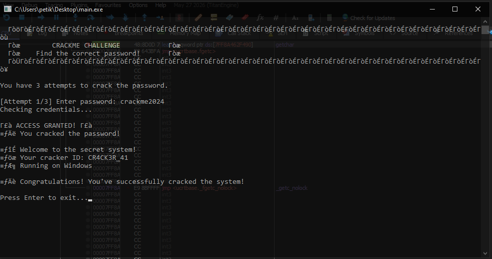
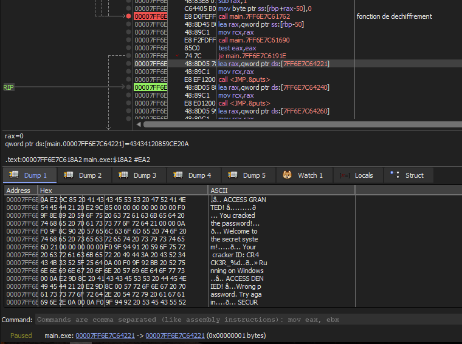

# chaltu's Double Door

> **Origine** : [`ORIGIN.yml`](ORIGIN.yml) · [crackmes.one](https://crackmes.one/crackme/6a9281f948cda5a2aaa3dbf3) · id `6a9281f948cda5a2aaa3dbf3`

Crackme **PE64** console (MinGW / GCC 16.1 MSYS2).  
Auteur site : **[chaltu](https://crackmes.one/user/chaltu)**.

Dossier : `authors/chaltu/6a9281f948cda5a2aaa3dbf3/` — [série auteur](../README.md) · [repo](../../../README.md).

| Fichier | Rôle |
|---|---|
| [`original/main.exe`](original/main.exe) | binaire d’origine |
| [`analysis/main.exe.i64.c`](analysis/main.exe.i64.c) | Hex-Rays (`decc`) |
| [`analysis/screenshot-ok.png`](analysis/screenshot-ok.png) | live Wine — `ACCESS GRANTED` |
| [`analysis/screenshot-x64dbg-access-granted.png`](analysis/screenshot-x64dbg-access-granted.png) | x64dbg — string `ACCESS GRANTED` @ `7FF66C104221` |
| [`tools/double-door-solve.py`](tools/double-door-solve.py) | extrait / vérifie le password |
| [`README.md`](README.md) | ce write-up |

## Réponse

Deux portes (`||`) :

| Porte | Entrée acceptée |
|---|---|
| **Primaire** | `crackme2024` (= `base64_decode("Y3JhY2ttZTIwMjQ=")` ) |
| **Backdoor** | toute chaîne contenant la sous-chaîne **`hack`** |

```bash
python3 tools/double-door-solve.py -q
# crackme2024

python3 tools/double-door-solve.py --check
# password = crackme2024
# backdoor = any input containing 'hack'
# …
# check: OK (logic + wine ACCESS GRANTED)
```

Live (Wine) :



```text
[Attempt 1/3] Enter password: crackme2024
Checking credentials...

✅ ACCESS GRANTED! ✅
🎉 You cracked the password!
…
```

---

## 1. Premier regard

```text
file original/main.exe
# PE32+ executable for MS Windows 5.02 (console), x86-64, 19 sections

diec original/main.exe
# PE64 · Compiler: MinGW
```

- SHA-256 `c9efb3849e555eb053d02dc9b2579caa69552276e363c47f8209b1463316b743`
- Strings utiles : alphabet Base64, `Y3JhY2ttZTIwMjQ=`, prompts « Enter password », `ACCESS GRANTED` / `DENIED`, 3 tentatives.
- Décompilation : `bash -ic 'decc original/main.exe'` → `analysis/main.exe.i64.c`.

---

## 2. Flow

```text
main():
  cls + banner
  for attempt in 1..3:
    fgets(password)
    loading_animation()   # « Checking credentials... »
    if check_password(password):
      ACCESS GRANTED + cracker ID aléatoire
      break
    else:
      ACCESS DENIED
  si échec ×3 → SECURITY ALERT / lock
  Press Enter to exit
```

---

## 3. Prédicat — les « deux portes »

`check_password` (Hex-Rays, extrait) :

```c
_BOOL8 __fastcall check_password(const char *a1)
{
  int v2;
  char Str2[56];

  base64_decode("Y3JhY2ttZTIwMjQ=", (__int64)Str2, &v2);
  return strcmp(a1, Str2) == 0 || strstr(a1, "hack") != nullptr;
}
```

1. Decode Base64 embarqué → plaintext **`crackme2024`**.
2. Succès si égalité stricte **ou** si `"hack"` apparaît n’importe où dans l’entrée.

Le titre *Double Door* décrit littéralement ce `||`.

---

## 4. Vérification

```bash
printf 'crackme2024\n\n' | WINEDEBUG=-all wine original/main.exe
# → ACCESS GRANTED

printf 'hack\n\n' | WINEDEBUG=-all wine original/main.exe
# → ACCESS GRANTED (porte backdoor)

printf 'nope\nnope\nnope\n' | WINEDEBUG=-all wine original/main.exe
# → SECURITY ALERT / System locked

python3 tools/double-door-solve.py --check
```

### x64dbg — message de succès

Recherche string dans la Memory Map : le littéral **`✅ ACCESS GRANTED! ✅`** est dans `main.exe` à  
`00007FF66C104221` (VA runtime ; RVA ≈ `0x4221` dans `.rdata`).  
Autour : `You cracked the password!`, `Welcome to the secret system!`, `Your cracker ID: CR4CK3R_%d`, etc. — le chemin « succès » de `main` après `check_password`.



---

## 5. Notes

- Pas d’obfuscation réelle : la cible Base64 est en clair dans `.rdata` / `strings`.
- Le backdoor `strstr(..., "hack")` est probablement volontaire (humour / 2ᵉ porte pédagogique).
- Animation `Sleep(300)` × 3 points avant le verdict — normal sous Wine.
- Pas de username : password seul.
