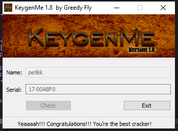

# crackmes.de's keygenme_v1.8 by greedy_fly

> **Origine** : [`ORIGIN.yml`](ORIGIN.yml) · [crackmes.one](https://crackmes.one/crackme/5ab77f6033c5d40ad448c894) · id `5ab77f6033c5d40ad448c894`

Crackme **PE32 GUI** MASM32, packé **ASPack 2.12–2.42** (stub + note PEditor 1.7). Auteur d’origine : **greedy_fly**.

| Fichier | Rôle |
|---|---|
| [`original/KeygenMe.exe`](original/KeygenMe.exe) | binaire (ASPack) |
| [`original/KeygenMe.zip`](original/KeygenMe.zip) | archive site |
| [`analysis/check-handler.asm`](analysis/check-handler.asm) | extrait du check (post-dump) |
| [`analysis/screenshot-ok.png`](analysis/screenshot-ok.png) | success (`qwerty` / `07-D745B4`) |
| [`tools/greedyfly18-solve.py`](tools/greedyfly18-solve.py) | keygen |

## Réponse

| Champ | Contrainte | Exemple |
|---|---|---|
| **Name** | longueur **6..12** | **`petikk`** |
| **Serial** | `XX-XXXXXX` (8 hex + `-`) | **`17-00ABF0`** |

`petik` (5 caractères) est **refusé** par le binaire → on prend **`petikk`**.

Référence interne du crackme : `qwerty` → `07-D745B4`.

```bash
python3 tools/greedyfly18-solve.py -q
# 17-00ABF0

python3 tools/greedyfly18-solve.py --check
# petikk → 17-00ABF0 … OK
# qwerty → 07-D745B4 … OK
```

---

## Premier regard

```text
PE32 GUI Intel 80386
MASM32 · Microsoft Linker 5.12
Packer: ASPack 2.12–2.42 (DIE) ; « Modified with PEditor 1.7 »
Titre: KeygenMe v1.8 by Greedy Fly
```

| | |
|---|---|
| SHA-256 (`KeygenMe.exe`) | `1cac6e22dc240f458820d7fff5d2977a3bc3a687e166e89fc033b5fc0e9eb991` |
| Name | 6..12 caractères |
| Serial | 9 chars, tiret en index 2 |
| OK | affiche le contrôle success (`0x66`), désactive name/serial/check |

Unpack : dump Scylla dans x32dbg (`keygenme_dump_scy`, image base `0x400000`).

---

## Flow

1. `DialogBoxParamA` — dlgproc `@ 0x401240`.
2. Bouton **Check** (`id 0x192`) : lit le name (`GetDlgItem` `0x195` + `WM_GETTEXT`).
3. Anti-debug léger (`pushf` / test TF) → bad si single-step.
4. Transform + **Adler-32** sur le name, puis transform + **CRC-32**.
5. Lit le serial (`id 0x196`), vérifie format, décode hex, compare `D + H == C`.
6. Succès : `ShowWindow` sur `0x66`, `EnableWindow(0)` sur check / name / serial.

---

## Prédicat

```text
b1[i] = (name[i] XOR 0x4E) << 1          # 8-bit
H     = Adler32(b1)                       # @ 0x4011E7, mod 0xFFF1
b2[i] = (name[i] + 5) XOR 0x1D
C     = CRC32(b2)                         # @ 0x401B60, table @ 0x403080
D     = (C - H) mod 2^32
serial = hex(D) avec tiret après 2 digits # "%08X" → XX-XXXXXX
```

| Name | Serial |
|---|---|
| `petikk` | **`17-00ABF0`** |
| `qwerty` | `07-D745B4` |
| `petik1` | `77-A347DF` |

---

## Vérification

```bash
python3 tools/greedyfly18-solve.py --user petikk
# user='petikk' serial=17-00ABF0
```

Preuve live **x32dbg** (dump Scylla) : `qwerty` / `07-D745B4` → success.



---

## Notes

- **Ce n’est pas** un serial libre : format fixe 8 hex + tiret.
- ASPack : reverse sur dump ; `original/KeygenMe.exe` reste packé.
- Nom d’exemple **`petikk`** (pas `petik`) à cause du min length 6.
- Anti-debug TF : éviter le step trop agressif sur le handler Check.
