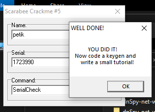

# crackmes.de's scarabee_crackme_5 by scarabee

> **Origine** : [`ORIGIN.yml`](ORIGIN.yml) · [crackmes.one](https://crackmes.one/crackme/5ab77f6133c5d40ad448c8fa) · id `5ab77f6133c5d40ad448c8fa`

Crackme **PE32 GUI** Delphi (Turbo Linker), packé **ASPack 2.00**. Auteur d’origine : **scarabee** (2003, crackmes.de).

| Fichier | Rôle |
|---|---|
| [`original/Crackme#5.exe`](original/Crackme#5.exe) | binaire (ASPack) |
| [`original/crackme5_scrb.zip`](original/crackme5_scrb.zip) | archive site (exe + readme) |
| [`original/readme.txt`](original/readme.txt) | note auteur |
| [`analysis/edit1change.asm`](analysis/edit1change.asm) | extrait du prédicat (post-unpack) |
| [`analysis/screenshot-ok.png`](analysis/screenshot-ok.png) | MessageBox *WELL DONE!* |
| [`tools/scarabee5-solve.py`](tools/scarabee5-solve.py) | keygen |

## Réponse

Trois champs (`Edit1` / `Edit2` / `Edit3`). Le check part sur **`Edit1Change`**.

| Champ | Rôle | Exemple |
|---|---|---|
| **Edit1** | unlock (chaîne fixe) | **`SerialCheck`** |
| **Edit3** | name (len ≥ 4) | **`petik`** |
| **Edit2** | serial | **`1723990`** |

Astuce : taper `About` dans Edit1 affiche le hint (*Find the correct input string…*).

```bash
python3 tools/scarabee5-solve.py -q
# 1723990

python3 tools/scarabee5-solve.py --check
# unlock=SerialCheck petik → 1723990 (expect 1723990) OK
```

---

## Premier regard

```text
PE32 executable (GUI) Intel 80386, for MS Windows
Linker: Turbo Linker 2.25 · Compiler: Borland Delphi · Packer: ASPack 2.000
EP RVA 0x60001 (.aspack) → OEP 0x44F510 (push ebp) après unpack
```

| | |
|---|---|
| SHA-256 (`Crackme#5.exe`) | `8452c4426a174a22035e5ecc12e151fd872926db45de0fe7bb151a9e0db809a8` |
| OK | *WELL DONE!* / *YOU DID IT!* |
| Hint (`About`) | *Find the correct input string for the serial comparisment…* |

Unpack live (x32dbg) : EP `pushad` → HWBP sur `[ESP]` → `popad` / `push 0x44F510` / `ret` (OEP). Dump Scylla utilisé pour l’analyse : `Crackme#5_dump_SCY.exe`.

---

## Flow

1. Form `TForm1` / `Unit1` — handler **`Edit1Change`** @ `0x44F018`.
2. Lit **Edit1** : chaque octet `c` → `(c XOR 0xE0) + 0x20`, concatène, compare à deux constantes encodées.
3. Si transform = **`SerialCheck`** → branche serial.
4. Si transform = **`About`** → `MessageBox` d’info / hint.
5. Sinon → sortie silencieuse.
6. Branche serial : `Length(Edit3) ≥ 4` et `Length(Edit2) ≥ 4`, calcule un entier depuis **Edit3**, `IntToStr`, compare à **Edit2**.
7. Match → *WELL DONE!* puis vide les trois Edit.

---

## Prédicat

### Unlock (Edit1)

```text
transform(c) = (ord(c) XOR 0xE0) + 0x20
transform("SerialCheck") == bytes at 0x44F250
transform("About")       == bytes at 0x44F264
```

### Serial (Edit3 → Edit2)

Entiers **signés 32-bit** (`imul` / `idiv`) :

```text
acc = 0
for i = 1 .. Length(name):          # 1-based
    acc += (Ord(name[i]) XOR 0x7D3) * i
    acc -= 0x1D
acc = acc * Length(name)
acc = acc div Ord(name[1])          # idiv
acc = acc * acc
serial = IntToStr(acc + 0x15)
```

| Name | Serial |
|---|---|
| `petik` | **`1723990`** |
| `test` | `450262` |
| `abcd` | `652885` |

Constante `0x7D3` = 2003 (année du crackme).

---

## Vérification

```bash
python3 tools/scarabee5-solve.py --user petik
# Edit1='SerialCheck' Edit3='petik' Edit2=1723990
```

Preuve live **x32dbg** (dump Scylla, image base `0x400000`) : saisie `SerialCheck` / `petik` / `1723990` → MessageBox **WELL DONE!**. OEP et handler confirmés dynamiquement après unpack ASPack (ESP-trick → `0x44F510`).



---

## Notes

- **Ce n’est pas** un keygen name→serial à deux champs seulement : il faut d’abord découvrir la chaîne d’unlock (`SerialCheck`), ce que le chemin `About` explique.
- ASPack : reverse / preuve sur dump ou mémoire dépackée ; le binaire livré dans `original/` reste packé.
- `Edit1Change` se déclenche à chaque modification d’Edit1 — remplir Edit3/Edit2 avant, puis (re)taper Edit1.
