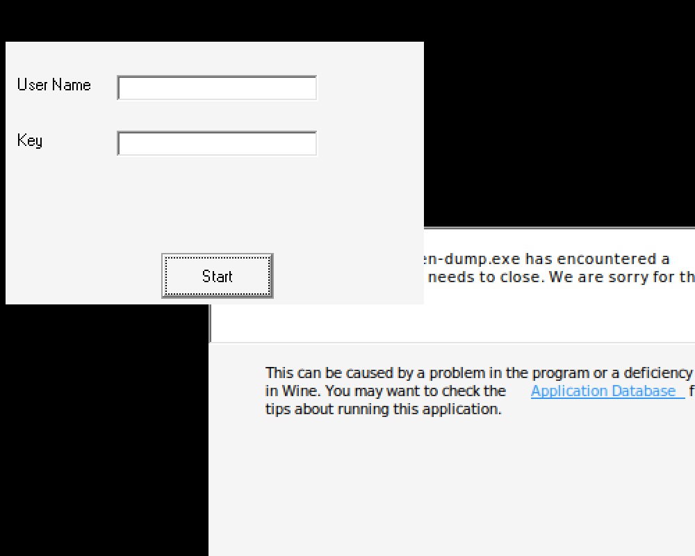

# crackmes.de's shisms_keygenme_0.1 by shism

> **Origine** : [`ORIGIN.yml`](ORIGIN.yml) · [crackmes.one](https://crackmes.one/crackme/5ab77f6633c5d40ad448cc29) · id `5ab77f6633c5d40ad448cc29`

Crackme **PE32 GUI** VB6 natif, protégé **Zastita**. Auteur d’origine : **shism** (2005).

| Fichier | Rôle |
|---|---|
| [`original/SKeygen.exe`](original/SKeygen.exe) | binaire |
| [`original/SKeygen.exe.asm`](original/SKeygen.exe.asm) | dump IDA |
| [`analysis/source/SKeygen.exe.i64.c`](analysis/source/SKeygen.exe.i64.c) | Hex-Rays (partiel) |
| [`tools/shism-keygenme-solve.py`](tools/shism-keygenme-solve.py) | keygen (graine fixe) |

## Réponse

| Champ | Valeur |
|---|---|
| User (exemple) | **`petik`** |
| Serial | **`715231907`** |

```bash
python3 tools/shism-keygenme-solve.py -q
# 715231907

python3 tools/shism-keygenme-solve.py --check
# petik → 715231907 … OK
```

Le serial ci-dessus est valide pour le modèle **GetTickCount = 0x12345678** (copie d’analyse `analysis/SKeygen-fixedseed.exe`). Sur le binaire stock, Zastita reseed à **chaque clic** → le XOR change à chaque essai (voir Notes).

---

## Premier regard

```text
PE32 executable (GUI) Intel 80386, for MS Windows
Visual Basic 6.00.8041 [Native]
MSVBVM60.DLL — Form « Shism KeyGen Me v 0.1 »
```

| | |
|---|---|
| SHA-256 (`SKeygen.exe`) | `40a07c23675750ec9c0d313217f0c4b1b23fdd6cee5ae72c0e46a0b38974e24c` |
| Username | longueur UI 5..7 |
| OK | *Congratulations, now make a keygen* |
| Bad | *Nice try HAHAHA loser* |



---

## Flow

1. Clic **Start** → `Command1_Click` (`sub_11002C10`).
2. Appel Zastita (`sub_110031D0`) → tableau d’entiers ; on lit l’élément **(1)** en `double` puis `CInt` / `__vbaFpI4`.
3. Contrôles username (vide, longueur).
4. `StrReverse(Username)` puis `Asc` du premier caractère (= dernier du nom).
5. `expected = Asc XOR CInt(Zastita(1))`.
6. `Val(Serial)` comparé en FPU (`fcomp`) à `expected`.

Asm (extrait) :

```asm
call    rtcStrReverse
call    rtcAnsiValueBstr      ; Asc
...
fld     [ebp+var_3C]          ; Zastita(1) en double
call    __vbaFpI4
xor     ebx, eax              ; ebx = Asc XOR key
fild    [ebp+var_F0]
...
call    __vbaR8Str            ; Val(serial)
fcomp   [ebp+var_34]
```

---

## Prédicat

```text
serial = Asc(username[-1])  XOR  ZastitaKey
```

Avec la graine fixe utilisée pour le solveur :

| Constante | Valeur |
|---|---|
| GetTickCount (patch) | `0x12345678` |
| `ZastitaKey` | **`0x2AA192C8`** (715231944) |
| `petik` → `Asc('k')` | 107 |
| serial | `107 XOR 0x2AA192C8` = **`715231907`** |

Preuve mémoire (dump du `xor ebx,eax` sous Wine, graine fixe) : la valeur calculée par le binaire est exactement `715231907` pour Asc forcé à `'k'`.

Zastita mélange un schedule type RC5 (constante `0x9E3779B9`), `Rnd` / `Randomize(GetTickCount±…)` et des S-box globales — d’où la dépendance au tick.

---

## Vérification

```bash
python3 tools/shism-keygenme-solve.py --user petik
# user='petik' serial=715231907
```

Sous Wine, les TextBox VB6 sont souvent illisibles / non peintes ; la validation fiable a été faite par dump du registre après le `xor` (voir `analysis/verify-result.txt`, binaires `SKeygen-fixedseed.exe` / `SKeygen-verify.exe`).

---

## Notes

- **Ce n’est pas** un keygen name→serial stable sur le PE stock : chaque clic appelle Zastita avec `Randomize` seedé par `GetTickCount`, donc le XOR change.
- Solution « scène 2005 » typique : *serial fishing* (SmartCheck / breakpoint sur le `xor`) pour une paire valide d’un run donné.
- Notre keygen documente la **formule** et donne des serials reproductibles dès que la graine est fixée (patch 6 octets sur le stub GetTickCount à `0x110020F8` : `B8 78 56 34 12 C3`).
- Solution historique crackmes.de : deroko (07.12.2005) — archive introuvable sur Wayback au moment de l’écriture.
- Anti-debug / self-debug strings présentes (`DebugActiveProcess`, etc.) dans le module Protect ; hors chemin du prédicat une fois le formulaire affiché.
