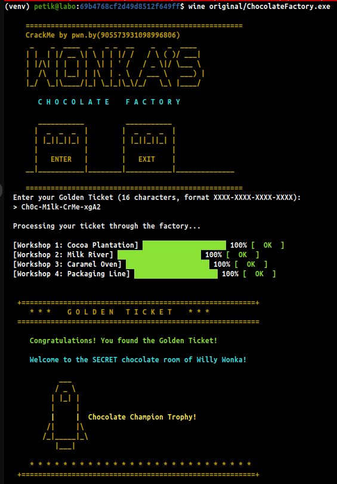

# CrackNotMe's Willy Wonka's Chocolate Factory

> **Origine** : [`ORIGIN.yml`](ORIGIN.yml) · [crackmes.one](https://crackmes.one/crackme/69b4768cf2d49d8512f649ff) · id `69b4768cf2d49d8512f649ff`

Crackme **PE32+ console** x86-64 (MSVC).  
Auteur site : **CrackNotMe** · « Willy Wonka's Chocolate Factory ».

Dossier : `authors/cracknotme/69b4768cf2d49d8512f649ff/` — [série auteur](../README.md) · [repo](../../../README.md).

| Fichier | Rôle |
|---|---|
| [`original/ChocolateFactory.exe`](original/ChocolateFactory.exe) | binaire d’origine |
| [`README.md`](README.md) | ce write-up |
| [`tools/chocolate-factory-solve.py`](tools/chocolate-factory-solve.py) | solveur + keygen / check |
| [`tools/chocolate-factory-keygen.py`](tools/chocolate-factory-keygen.py) | alias keygen (`--keygen` par défaut) |
| [`analysis/screenshot01.png`](analysis/screenshot01.png) | Wine : ticket → 4× OK + Golden Ticket |
| [`analysis/wine-success-summary.txt`](analysis/wine-success-summary.txt) | extrait texte preuve Wine |

## Réponse

| Input | Valeur |
|---|---|
| Golden Ticket | **`Ch0c-M1lk-CrMe-choT`** |

(Format annoncé `XXXX-XXXX-XXXX-XXXX` ; tirets et espaces sont **strippés** — `Ch0cM1lkCrMechoT` marche aussi.)

Le 4ᵉ groupe n’est **pas** unique : tout suffixe dont le CRC Packaging retourne `0` convient (ex. `ALk6`, `YA0A`, …). `choT` est un choix thématique parmi ~200 préimages alphanum.

```bash
python3 tools/chocolate-factory-solve.py -q
# Ch0c-M1lk-CrMe-choT

python3 tools/chocolate-factory-solve.py --check 'Ch0c-M1lk-CrMe-choT'
# OK

# Keygen : préfixe fixe Ch0c-M1lk-CrMe- + un des 202 suffixes CRC alnum
python3 tools/chocolate-factory-keygen.py
python3 tools/chocolate-factory-keygen.py -n 10
python3 tools/chocolate-factory-keygen.py --all          # les 202
python3 tools/chocolate-factory-solve.py --keygen --flat --seed 42
```

Message succès : *Congratulations! You found the Golden Ticket!* / *Chocolate Champion Trophy!*

Preuve live : [screenshot01.png](analysis/screenshot01.png).



---

## 1. Premier regard

```text
file original/ChocolateFactory.exe
# PE32+ executable (console) x86-64, for MS Windows
```

Banner ASCII « CHOCOLATE FACTORY », prompt :

```text
Enter your Golden Ticket (16 characters, format XXXX-XXXX-XXXX-XXXX):
```

Puis 4 ateliers avec barre de progression : **Cocoa Plantation**, **Milk River**, **Caramel Oven**, **Packaging Line** → `OK` / `FAIL`.

Hashes :  
MD5 `41cc12f08945987065675f45b278ce1c` · SHA-256 `1737657d3a16df2d5aab21835e31c1c37d6dcc74287c212a3adc30162f0d9e80`.

---

## 2. Flow

```text
lire ticket
  strip '-' et ' '  → buffer 16 octets (sinon erreur longueur)
  blacklist :
    motif répétitif "WONK" sur les 16 chars
    ticket tout à '0'
    "HELPHELPHELPHELP" / "HELP"
  timeout GetTickCount (~2 min max depuis le start)

pour chaque atelier 1..4 :
  animation barre + PASS/FAIL

si les 4 OK :
  r14 = dword S-box W1
  r14 ^= 0xc3811deb   # → 0 si W1 OK
  call success (bannière XOR-déchiffrée avec OR des octets de r14)
sinon :
  message d’échec
```

---

## 3. Anti-debug (S-box)

Avant l’atelier Cocoa :

```c
ecx = IsDebuggerPresent() ? 0x37 : 0;
if (PEB && (PEB->NtGlobalFlag & 0x70))
    ecx = 0x42;
index = ticket_byte ^ ecx;
s = SBOX[index];   // table @ 0x14001b560
```

Sous Wine / run propre : **`ecx = 0`**. Sous debugger visible les préimages S-box deviennent non imprimables — tester sans debugger.

---

## 4. Atelier 1 — Cocoa Plantation

```c
dword = S[t0]<<24 | S[t1]<<16 | S[t2]<<8 | S[t3];
ok = (dword == 0xc3811deb);
```

Inversion (anti = 0) :

| cible S | char |
|---|---|
| `0xc3` | `C` |
| `0x81` | `h` |
| `0x1d` | `0` |
| `0xeb` | `c` |

→ **`Ch0c`**.

---

## 5. Atelier 2 — Milk River

Matrice de poids `@ 0x14001b660` (4×4) et cibles `@ 0x14001b6a0` :

```text
W = [[3,7,2,5],[5,3,8,1],[2,9,1,4],[6,1,4,7]]
E = [0x2d, 0xdf, 0x6b, 0x9c]
```

```c
for i in 0..3:
    sum_j (W[i][j] * t[4+j]) & 0xff  == E[i]
```

Unique en alphanum : **`M1lk`**.

---

## 6. Atelier 3 — Caramel Oven

Sur `t8..t11` (copies aussi en `rsp+0x20..0x23`) :

```c
r8  = (t10 << 8) | t11;
edx = (t8  << 8) | t9;
// rotl16(r8 - 0x3502, 5) * 0x7a69  → mélange avec edx
// puis rotl16(edx' - 0x3f40, 5) * 0x7a69
// ebx = mix | (edx << 16)
ok = (ebx == 0x16cb7cb);
```

Unique en alphanum : **`CrMe`**.

---

## 7. Atelier 4 — Packaging Line

Appel `@ 0x1400025f0` :

| arg | pointeur | groupe |
|---|---|---|
| rcx | `rsp+0x3c` | `t12..t15` (Packaging) |
| rdx | `rsp+0x30` | `t0..t3` (Cocoa) |
| r8  | `rsp+0x34` | `t4..t7` (Milk) |
| r9  | `rsp+0x38` | `t8..t11` (Caramel) |

```c
seed = sum8(A) ^ sum8(B) ^ sum8(C);
reg  = ~seed;                 // 16-bit
for byte in D:
    reg ^= (byte << 8);
    // 8× : si MSB set → (reg<<1) ^ 0x1021 sinon reg<<1
ok = (reg == 0);
```

Poly **`0x1021`** (CRC-16 style). Avec `Ch0c`/`M1lk`/`CrMe`, **202** suffixes `D` alphanum donnent `reg == 0` (table intégrée dans le keygen). Canon retenu : **`choT`**.

---

## 8. Vérification

### Live Wine ([screenshot01.png](analysis/screenshot01.png))


```bash
printf 'Ch0c-M1lk-CrMe-choT\n' | wine original/ChocolateFactory.exe
# Workshops 1..4 → [ OK ]
# Congratulations! You found the Golden Ticket!
```

Extrait texte : [`analysis/wine-success-summary.txt`](analysis/wine-success-summary.txt).

```bash
python3 tools/chocolate-factory-solve.py --check Ch0cM1lkCrMechoT
# OK
python3 tools/chocolate-factory-keygen.py -n 5 --seed 1
python3 tools/chocolate-factory-solve.py --w4 --limit 5
```

---

## 9. Notes

- Ce n’est **pas** un challenge de la série CFB (#1…#10) : même auteur, thème « factory » différent (Wonka).
- Blacklist `WONK` / `HELP…` / tout-`0` : pièges pour les guessers.
- Le message final est XOR-chiffré avec `OR` des octets du dword W1 après `^= 0xc3811deb` ; si W1 est bon, la clé vaut `0` et le texte est déjà lisible.
- Ne pas patcher `original/` ; le solveur lit la S-box depuis le PE.
