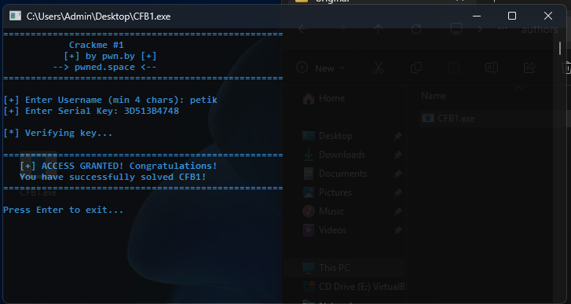
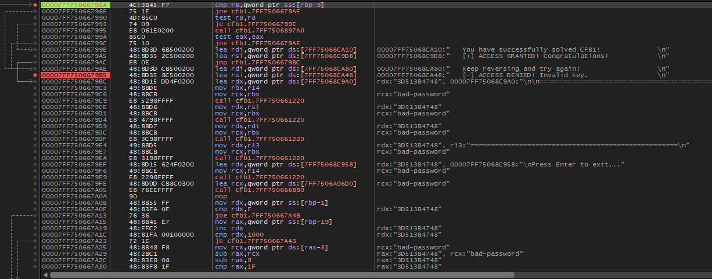

# CrackmesForBeginners (CFB) #1

> **Origine** : [`ORIGIN.yml`](ORIGIN.yml) · [crackmes.one](https://crackmes.one/crackme/6a1547f42b3df128c1df5ca5) · id `6a1547f42b3df128c1df5ca5`

Crackme **PE32+ console** (x86-64), C++ MSVC (VS 2026 / toolset 19.50).  
Auteur site : **CrackNotMe** · tagline `pwn.by` / `pwned.space`.

Dossier : `authors/cracknotme/6a1547f42b3df128c1df5ca5/` — [série auteur](../README.md) · [repo](../../../README.md).

| Fichier | Rôle |
|---|---|
| [`original/CFB1.exe`](original/CFB1.exe) | binaire d’origine |
| [`README.md`](README.md) | ce write-up |
| [`tools/cfb1-solve.py`](tools/cfb1-solve.py) | keygen Python (username → serial) |
| [`analysis/screenshot01.png`](analysis/screenshot01.png) | x64dbg : branche success / deny |
| [`analysis/screenshot02.png`](analysis/screenshot02.png) | live : `petik` / `3D513B4748` → GRANTED |

## Réponse

| Input | Valeur | Exemple |
|---|---|---|
| Username | ≥ 4 caractères | `petik` |
| Serial Key | hex majuscule, **2 chiffres par caractère** du username | **`3D513B4748`** |

```bash
python3 tools/cfb1-solve.py petik
# Serial   : 3D513B4748
```

Preuve live : [screenshot02.png](analysis/screenshot02.png).

---

## 1. Premier regard

```
file original/CFB1.exe
# PE32+ executable (console) x86-64

diec → MSVC 19.50 / VS 2026, linker 14.50
```

Console interactive (pas de dialog Win32) :

```text
[+] Enter Username (min 4 chars):
[+] Enter Serial Key:
[*] Verifying key...
    [+] ACCESS GRANTED! …  ou  [-] ACCESS DENIED! Invalid key.
```

Hashes :  
MD5 `9a38d7317c01bf69463b556da5e8fdc2` · SHA-256 `2806a1d20c1cc2d1c1bcc7e2e3a90963ad990376ae52f3c0889a88dbd86eb311`.

---

## 2. Flow

```
banner Crackme #1 / pwn.by / pwned.space
lire username (std::string, trim espaces)
si len < 4 → erreur "too short", exit
lire serial
"[*] Verifying key..."
expected = keygen(username)     ; boucle par caractère → hex
si serial == expected  (memcmp / string compare)
  → ACCESS GRANTED + "You have successfully solved CFB1!"
sinon
  → ACCESS DENIED! Invalid key.
"Press Enter to exit..."
```

Le gros bruit autour de `cmp rdx, 1000` / `[rax-8]` dans x64dbg = **destructeurs `std::string` MSVC**, pas la crypto.

---

## 3. Le prédicat (keygen)

Pour chaque index `i` et octet `c = username[i]` :

```text
b = ((i + 0x5A) XOR c) + 0x13
serial += sprintf("%02X", b & 0xFF)   # majuscules
```

En asm (dérivation ~`0x1400066E0`) :

```asm
lea  eax, [i + 0x5A]
xor  al, username[i]
add  al, 0x13
; ostream hex, width 2, fill '0'
```

Comparaison : chaîne attendue vs saisie (même longueur = `2 × len(username)`).

### Trace `petik`

| i | char | `i+0x5A` | XOR | `+0x13` | hex |
|---|---|---|---|---|---|
| 0 | `p` `0x70` | `0x5A` | `0x2A` | `0x3D` | `3D` |
| 1 | `e` `0x65` | `0x5B` | `0x3E` | `0x51` | `51` |
| 2 | `t` `0x74` | `0x5C` | `0x28` | `0x3B` | `3B` |
| 3 | `i` `0x69` | `0x5D` | `0x34` | `0x47` | `47` |
| 4 | `k` `0x6B` | `0x5E` | `0x35` | `0x48` | `48` |

→ **`3D513B4748`**

### Pseudo-Python

```python
def serial_for(username: str) -> str:
    assert len(username) >= 4
    out = []
    for i, c in enumerate(username.encode("latin-1")):
        b = (((i + 0x5A) & 0xFF) ^ c) + 0x13
        out.append(f"{b & 0xFF:02X}")
    return "".join(out)
```

---

## 4. Vérification

### Live (screenshot02)



### x64dbg (screenshot01)



Compare de longueurs puis branche success (`ACCESS GRANTED` / *solved CFB1*) vs deny.

### Keygen

```bash
cd authors/cracknotme/6a1547f42b3df128c1df5ca5
python3 tools/cfb1-solve.py petik
python3 tools/cfb1-solve.py -q petik
python3 tools/cfb1-solve.py --check petik 3D513B4748
```

---

## 5. Solveur Python

[`tools/cfb1-solve.py`](tools/cfb1-solve.py) — login en argument, option `-q` / `--check`.

---

## 6. Notes

- C++ avec `std::string` / iostream : le listing est bruyant ; la formule tient en **3 instructions** par caractère.
- Serial = **hex**, pas Base64 ni hash : longueur = `2 × len(username)`.
- Username trop court (< 4) : fail avant même de lire le serial.
- Série CFB : premier challenge de CrackNotMe dans ce repo.
