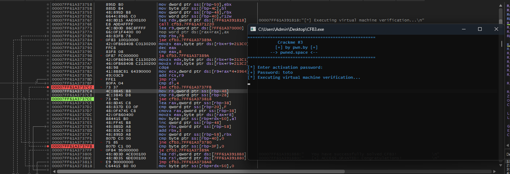
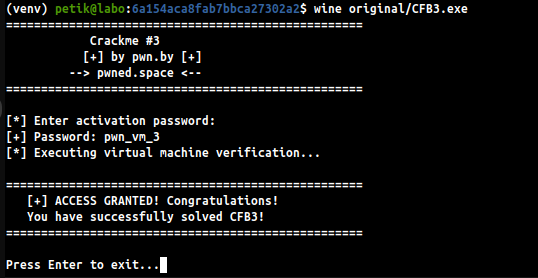

# CrackmesForBeginners (CFB) #3 — Mini VM password

> **Origine** : [`ORIGIN.yml`](ORIGIN.yml) · [crackmes.one](https://crackmes.one/crackme/6a154aca8fab7bbca27302a2) · id `6a154aca8fab7bbca27302a2`

Crackme **PE32+ console** (x86-64), C++ MSVC (VS 2026 / toolset 19.50).  
Auteur site : **CrackNotMe** · tagline `pwn.by` / `pwned.space`.

Dossier : `authors/cracknotme/6a154aca8fab7bbca27302a2/` — [série auteur](../README.md) · [repo](../../../README.md).

| Fichier | Rôle |
|---|---|
| [`original/CFB3.exe`](original/CFB3.exe) | binaire d’origine |
| [`README.md`](README.md) | ce write-up |
| [`tools/cfb3-solve.py`](tools/cfb3-solve.py) | désasm / simu VM + password |
| [`analysis/screenshot-ok.png`](analysis/screenshot-ok.png) | Wine : `pwn_vm_3` → **ACCESS GRANTED** |
| [`analysis/screenshot-verification-vm.png`](analysis/screenshot-verification-vm.png) | x64dbg : boucle interpréteur VM |

## Réponse

| Input | Valeur |
|---|---|
| Activation password | **`pwn_vm_3`** (underscores `_`, **pas** de tirets `-`) |

```bash
python3 tools/cfb3-solve.py -q
# pwn_vm_3
```

```text
p w n _ v m _ 3     ← 8 caractères ; 0x5f = '_'
```

Preuve live : [screenshot-ok.png](analysis/screenshot-ok.png).

---

## 1. Premier regard

```text
file original/CFB3.exe
# PE32+ executable (console) x86-64
```

```text
[*] Enter activation password:
[+] Password: …
[*] Executing virtual machine verification...
   [+] ACCESS GRANTED! …   ou   [-] ACCESS DENIED! Invalid password.
```

Hashes :  
MD5 `241b6b3865204d9e0ba2b75d179ee462` · SHA-256 `5398416bb82f08c4f6a8779b83d97d2137a058218b07b0f7098ef70cdb639aca`.

Un seul secret : le password (pas de username).

---

## 2. Flow

```text
banner CFB3
lire password (getline + trim)
si vide → erreur
afficher "[*] Executing virtual machine verification..."
  → ce n’est PAS une détection d’hyperviseur / VMware
  → c’est le lancement de la mini-VM propriétaire (bytecode)
IP = 0, regs[4] = 0, flag = 0, pwd_index = 0
tant que IP*3 < 0x78 :
  raw = bytecode[IP*3]
  a,b = operandes
  handler = jump_table[raw - 1]
  …
si opcode OK → ACCESS GRANTED
sinon / FAIL / sortie anormale → ACCESS DENIED
```

### « Virtual machine verification » — ce que c’est

Le message console **`[*] Executing virtual machine verification...`** (`.rdata` `0x140021818`) est imprimé **juste avant** la boucle interpréteur (`~0x140003767` → `lea rdx, … ; call puts-like`).

| Interprétation naïve | Réalité dans CFB3 |
|---|---|
| Anti-VM (VMware / VirtualBox / QEMU) | **Non** |
| Sandbox / `IsDebuggerPresent` comme gate | **Non** (import CRT possible, pas le prédicat password) |
| Mini-VM **maison** sur un bytecode | **Oui** — vérification du password *via* cette VM |

Preuve dynamique (x64dbg, Windows) : [screenshot-verification-vm.png](analysis/screenshot-verification-vm.png)



Sur le listing on voit notamment :

```text
lea  rdx, "[*] Executing virtual machine verification..."
call …                          ; print
…
cmp  rbx, 0x78                  ; borne bytecode
movzx eax, byte [rbx+r9+0x213c0]; fetch opcode
dec  eax
cmp  eax, 8
ja   deny
movzx edx, byte […+0x213c1]     ; op A
movzx r8d, byte […+0x213c2]     ; op B
mov  ecx, [r9+rax*4+0x3964]     ; jump table
add  rcx, r9
jmp  rcx                        ; dispatch handler
```

État runtime typique pendant un `LOAD` :

| Slot stack (main) | Rôle |
|---|---|
| `[rbp-0x58]` | IP (offset dans le bytecode, pas +3) |
| `[rbp-0x50 … -0x4D]` | 4 registres 8-bit |
| `[rbp-0x4C]` | flag CMP (`sete`) |
| `[rbp-0x48]` | index password |
| `[rbp-0x40]` | run flag (word, init `1`) |

**Note** : des `cpuid` existent plus loin dans le binaire (init MSVC / features CPU, signature `GenuineIntel` via XOR `0x6c65746e`…). Ce n’est **pas** la « virtual machine verification » du challenge.

---

## 3. La mini-VM

### Emplacements

| Élément | VA | File offset |
|---|---|---|
| Bytecode (0x78 octets, 40 instr × 3) | `0x1400213c0` | `0x1fdc0` |
| Jump table (9 × DWORD RVA) | `0x140003964` | `0x2d64` |
| Message « Executing virtual machine… » | `0x140021818` | |
| Print du message + entrée boucle | `~0x140003767` | |
| Boucle fetch/decode/dispatch | `~0x140003780` | |

### Opcodes (valeur **brute** dans le bytecode)

Avant le `jmp` : `dec eax` → index handler = `raw - 1`.

| raw | Nom | Effet |
|---|---|---|
| 1 | **LOAD** | `reg[a] = password[i++]` ; si fin de chaîne → `0` |
| 2 | **IMM** | `reg[a] = b` |
| 3 | **ADD** | `reg[a] = (reg[a] + reg[b]) & 0xFF` |
| 4 | **XOR** | `reg[a] ^= reg[b]` |
| 5 | **XORI** | `reg[a] ^= b` |
| 6 | **CMP** | `flag = (reg[a] == b)` |
| 7 | **JNE** | si `!flag` : `IP = b` ; sinon `IP++` |
| 8 | **OK** | succès (ACCESS GRANTED) |
| 9 | **FAIL** | échec |

Registres : 4 octets (`a,b ∈ [0..3]`).  
`JNE` échoue vers l’instruction **0x27** (opcode FAIL) dans ce programme.

### Programme (résumé)

Pour chaque caractère `c0…c7` :

```text
LOAD r0          ; octet password
  (XORI imm  |  IMM r1 + ADD r0,r1)
CMP  r0, target
JNE  fail        ; IP = 0x27
```

Puis :

```text
LOAD r0          ; 9ᵉ lecture → 0 car fin de mdp
CMP  r0, 0
JNE  fail
OK
```

→ le password fait **exactement 8 caractères**.

### Inversion

| i | ops | contrainte | `c` |
|---|---|---|---|
| 0 | `^= 0x13` | `c^0x13 == 0x63` | **`p`** `0x70` |
| 1 | `+= 0x24` | `c+0x24 == 0x9b` | **`w`** `0x77` |
| 2 | `^= 0x5a` | `c^0x5a == 0x34` | **`n`** `0x6e` |
| 3 | `^= 0xac` | `c^0xac == 0xf3` | **`_`** `0x5f` |
| 4 | `+= 0x0f` | `c+0x0f == 0x85` | **`v`** `0x76` |
| 5 | `^= 0xff` | `c^0xff == 0x92` | **`m`** `0x6d` |
| 6 | `+= 0x33` | `c+0x33 == 0x92` | **`_`** `0x5f` |
| 7 | `^= 0x1e` | `c^0x1e == 0x2d` | **`3`** `0x33` |

→ **`pwn_vm_3`**

Piège fréquent : `pwn-vm-3` (tirets) **échoue** — les positions 3 et 6 sont des **`_`** (`0x5f`), pas `-` (`0x2d`).

---

## 4. Vérification

### Live Wine (screenshot-ok)



### Live x64dbg (screenshot-verification-vm)


Password `pwn_vm_3` → message *Executing virtual machine verification...* → **ACCESS GRANTED** (PC dans le handler `LOAD` / boucle `~0x…3780`).

### Solveur

```bash
cd authors/cracknotme/6a154aca8fab7bbca27302a2
python3 tools/cfb3-solve.py
python3 tools/cfb3-solve.py --check pwn_vm_3
# OK
python3 tools/cfb3-solve.py --check pwn-vm-3
# FAIL

printf 'pwn_vm_3\n\n' | wine original/CFB3.exe
# [*] Executing virtual machine verification...
# [+] ACCESS GRANTED! … solved CFB3!
```

Désassemblage bytecode :

```bash
python3 tools/cfb3-solve.py --trace
```

---

## 5. Solveur Python

[`tools/cfb3-solve.py`](tools/cfb3-solve.py) — bytecode embarqué (ou `--pe`), simulateur, recovery, `--check`.

---

## 6. Notes

- Suite CFB : #1 serial hex, #2 maze WASD, **#3 interpréteur maison**.
- « **virtual machine verification** » = exécution du **bytecode custom**, pas un test « suis-je dans une VM ».
- Password = **underscores** : `pwn_vm_3` ; tirets `pwn-vm-3` → DENIED.
- Pas de crypto lourde : contraintes linéaires (XOR / ADD) byte à byte.
- Opcode **4** (XOR registre/registre) est dans la table mais **non utilisé** par ce programme.
- `IsDebuggerPresent` / `cpuid` MSVC : bruit de runtime, hors prédicat.
