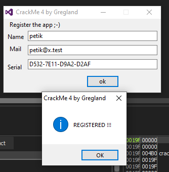

# gregland's CrackMe 4

> **Origine** : [`ORIGIN.yml`](ORIGIN.yml) · [crackmes.one](https://crackmes.one/crackme/5b502da833c5d41c0b8ae514) · id `5b502da833c5d41c0b8ae514`

Crackme **PE32 GUI** — runtime **Visual DialogScript (VDS)** 6.x (Delphi), **sans UPX**.  
Suite de [CrackMe #1](../5b4cc23733c5d467513d2d0d/) / [#2](../5b4df56233c5d46d830c3f3a/) / [#3](../5b4f76f233c5d41c0b8ae506/) : SCRIPT compressé + tokens protect, **keygenme** name+mail→serial, anti-debug `@FUME`.  
Auteur site : **[gregland](https://crackmes.one/user/gregland)**.

Dossier : `authors/gregland/5b502da833c5d41c0b8ae514/` — [série auteur](../README.md) · [repo](../../../README.md).

| Fichier | Rôle |
|---|---|
| [`original/crackme4.exe`](original/crackme4.exe) | binaire d’origine (~934 KiB) |
| [`analysis/resources/TEXT_SCRIPT_2977.bin`](analysis/resources/TEXT_SCRIPT_2977.bin) | ressource `TEXT/SCRIPT` |
| [`analysis/script-decrypted.txt`](analysis/script-decrypted.txt) | script VDS après decompress + nibble-decrypt |
| [`analysis/live-check-ok.txt`](analysis/live-check-ok.txt) | preuve x32dbg → *REGISTERED !!!* |
| [`analysis/screenshot-registered.png`](analysis/screenshot-registered.png) | MsgBox *REGISTERED !!!* (petik) |
| [`tools/crackme4-solve.py`](tools/crackme4-solve.py) | keygen |
| [`tools/live-try.au3`](tools/live-try.au3) | automation (Wine : comparaison toujours PROBLEM) |

## Réponse

Keygen **name + mail → serial** `XXXX-XXXX-XXXX-XXXX` :

| | |
|---|---|
| **Name** (exemple) | **`petik`** |
| **Mail** | **`petik@x.test`** |
| **Serial** | **`D532-7E11-D9A2-D2AF`** |
| **Bouton** | **`ok`** → `:okbutton` |

```bash
python3 tools/crackme4-solve.py
# name   : petik
# mail   : petik@x.test
# serial : D532-7E11-D9A2-D2AF

python3 tools/crackme4-solve.py -q --name HN1 --mail hackpower1@mail.ru
# F5B5-6FE3-7208-7F00

python3 tools/crackme4-solve.py --check D532-7E11-D9A2-D2AF
# OK
```

Live (**Windows / x32dbg**) : MsgBox **`REGISTERED !!!`** (après patch `IsDebuggerPresent` / Hide debugger) :



Sous **Wine**, le même serial (et le commentaire HN1) renvoient encore `PROBLEM WITH THE LICENCE !` — runtime VDS/keygen peu fiable sous Wine ici ; la preuve retenue est Windows.

---

## 1. Premier regard

```text
file original/crackme4.exe
# PE32 GUI Intel i386, 8 sections (pas d’UPX)

diec original/crackme4.exe
# Borland Delphi(2005) + Turbo Linker 6.0
# (DIE « AutoIt » = faux positif, comme #1–#3)
```

Hashes : MD5 `03c569f9eb501207f5b0c5bfb9f69fbc` · SHA-256 `5979d37ed9d7b63fb0781f147b4b4d466a44572b3f966add4ae8b71ec7a57354`.

GUI : champs **Name** / **Mail** / **Serial** + bouton `ok`.

---

## 2. Flow

```text
OEP Delphi/VDS
  FindResourceA(SCRIPT/TEXT) → blob 2977 octets (magic -501)
  decompress + ligne0 chr(47-b)
  header 0600 + 3×8 digits → RandSeed
    87437083 + 20508453 + 12516347 = 120461883
  nibble-decrypt → script clair
  GUI « CrackMe 4 by Gregland »
    :okbutton
      @FUME(DISASSEMBLER|DEBUGGER) → sinon « DEBUGGER ;-( »
      EQUAL( serial , @VDSReg(Keygen, mail, nom, 7806) )
        → REGISTERED !!!  /  PROBLEM WITH THE LICENCE !
```

---

## 3. Prédicat (Keygen)

Extrait ([`analysis/script-decrypted.txt`](analysis/script-decrypted.txt)) — tokens protect (`@_J`, `@_˜`≈STRINS, `@_›`≈SUBSTR, `@_¤`≈format/concat, `@_q`≈LEN, `@_G`≈DIV) :

```text
:Keygen
%4 = @_J(%2,%3)                          ; @_J(nom, 7806)
%A = SUBSTR(SUBSTR(@_J(STRINS(mail, LEN/2, @_J(%4,215)), md5), 7, 22), 1, 4)
%B = … (5,8)   %C = … (9,12)   %D = … (13,16)
_< @_¤(%A-%B-%C-%D)                       ; « A-B-C-D »
```

Appel : `@VDSReg(Keygen, mail, nom, 7806)` → args effectifs `%1=mail`, `%2=nom`, `%3=7806`.

### `@_J(str, int)` — ENCRYPT / numberhash

Delphi `Random` : `RandSeed = RandSeed * 0x08088405 + 1`, puis  
`out[i] = in[i] ^ (Random(0x80) | 0x80)` avec `RandSeed` initial = la clé entière (`7806`, puis `215`). Seed restauré après l’appel (déterministe).

### `@_J(buf, md5)`

MD5 du buffer → hex **majuscules** (32 chars).  
`SUBSTR(hex, 7, 22)` (1-based, inclus) = 16 hex du milieu → quatre blocs de 4 avec tirets.

Pour `petik` / `petik@x.test` :

| Étape | Valeur |
|---|---|
| `@_J(petik, 7806)` | `89d39aca8f` |
| `@_J(…, 215)` | `56673f630f` (`Vg?c\x0f`) |
| STRINS mail | `petik` + insert + `@x.test` |
| MD5 | `C77CB1D5327E11D9A2D2AFFA309A3FEC` |
| serial | **`D532-7E11-D9A2-D2AF`** |

Anti-debug (`:FUME_*`) : `IsDebuggerPresent`, fenêtres IDA/SoftICE, etc. Sous x32dbg : patcher `IsDebuggerPresent` (`31 C0 C3`) et/ou Hide debugger, ignorer `0EEDFADE`.

---

## 4. Vérification

```bash
python3 tools/crackme4-solve.py --check D532-7E11-D9A2-D2AF   # OK
python3 tools/crackme4-solve.py -q --name HN1 --mail hackpower1@mail.ru
# F5B5-6FE3-7208-7F00  (commentaire crackmes.one / HN1 2019)
```

Live Windows (x32dbg, anti-debug contourné) : **`REGISTERED !!!`** pour petik.  
Preuve : [`analysis/screenshot-registered.png`](analysis/screenshot-registered.png) · [`analysis/live-check-ok.txt`](analysis/live-check-ok.txt).

---

## 5. Notes

- Même pipeline SCRIPT que #1–#3 ; ici **pas d’UPX**, prédicat = **keygen** (plus un password fixe).
- Ordre UI : Name / Mail / Serial — ne pas confondre avec l’ordre des args Keygen `(mail, nom, 7806)`.
- Si `mail == "CPU"`, le script remplace le mail par le serial de volume `C:\` (`@_©` / VOLINFO) — cas spécial non requis pour petik.
- Wine : automation remplit bien les edits, mais la comparaison licence échoue (même serial HN1 publié) → ne pas s’y fier pour la preuve.
- Réf. publique : solution [bagolymadar](https://crackmes.one/solution/5b5d002633c5d46b771434ce) (algo identique).
