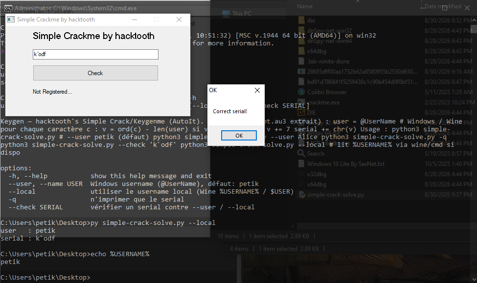

# hacktooth's Simple Crack/Keygenme

> **Origine** : [`ORIGIN.yml`](ORIGIN.yml) · [crackmes.one](https://crackmes.one/crackme/63f6881b33c5d447bc761585) · id `63f6881b33c5d447bc761585`

Crackme **PE32 GUI** compilé **AutoIt v3** (`AU3!EA06`).  
Auteur site : **[hacktooth](https://crackmes.one/user/hacktooth)**.

Dossier : `authors/hacktooth/63f6881b33c5d447bc761585/` — [série auteur](../README.md) · [repo](../../../README.md).

| Fichier | Rôle |
|---|---|
| [`original/crackme.exe`](original/crackme.exe) | binaire d’origine (stub AutoIt + script) |
| [`analysis/autoit/script.au3`](analysis/autoit/script.au3) | script extrait (`autoit-ripper`) |
| [`analysis/predicate.au3`](analysis/predicate.au3) | extrait : keygen + GUI Koda |
| [`analysis/screenshot-ok.png`](analysis/screenshot-ok.png) | live : serial `k\`odf` → **Correct serial!** |
| [`analysis/live-check-ok.txt`](analysis/live-check-ok.txt) | automation Wine → même résultat |
| [`tools/simple-crack-solve.py`](tools/simple-crack-solve.py) | keygen Python |
| [`tools/dump-key.au3`](tools/dump-key.au3) | même prédicat sous AutoIt3 |
| [`tools/live-check.au3`](tools/live-check.au3) | automation ControlSetText / Check |
| [`README.md`](README.md) | ce write-up |

## Réponse

Le serial est dérivé du **nom d’utilisateur Windows** (`@UserName`) — pas d’entrée login séparée.

| Username (`@UserName`) | Serial |
|---|---|
| **`petik`** (défaut / Wine local) | **`k\`odf`** |



```bash
python3 tools/simple-crack-solve.py
# user   : petik
# serial : k`odf

python3 tools/simple-crack-solve.py -q
# k`odf

python3 tools/simple-crack-solve.py --check 'k`odf'
# OK

python3 tools/simple-crack-solve.py --local   # %USERNAME% via Wine
```

Formule :

```text
n = len(username)
pour chaque caractère c :
    v = ord(c) - n
    si v == 95 ('_') : v += 7
    serial += chr(v)
```

---

## 1. Premier regard

```text
file original/crackme.exe
# PE32 executable for MS Windows 5.01 (GUI), Intel i386, 5 sections

diec original/crackme.exe
# Format: AutoIt(3.XX)
# Linker: Microsoft Linker(14.16…) / VS 2017
```

- ~943 KiB, GUI Koda : titre *Simple Crackme by hacktooth*, champ serial, bouton **Check**.
- Signature script emballé : `AU3!EA06` (offsets `0xd7820`, `0xe3cba`).
- Chaînes runtime AutoIt (`@AutoIt`, `>>>AUTOIT SCRIPT<<<`, …) ; peu de strings métier en clair dans le PE (script compressé).

Hashes :  
MD5 `15420a7707bf302cec547151b8163073` · SHA-256 `18a79ce74a044c1f61b987435efa8a8d4ba93f6e30018d7235197cb1e054ecce`.

**Pas besoin de x64dbg / x32dbg** : extraction du `.au3` suffit (et c’est du PE32 — ce serait x32dbg si on debuggait le stub).

---

## 2. Extraction AutoIt

```bash
pip3 install autoit-ripper   # une fois
autoit-ripper --verbose original/crackme.exe analysis/autoit/
# → analysis/autoit/script.au3  (~146 KiB, beaucoup d’includes ArrayDisplay/…)
```

Métadonnées ripper utiles :

- chemin de build : `C:\Users\hacktooth\AppData\Local\AutoIt v3\Aut2Exe\…`
- date fichier ~ `2023-02-22`
- blob compressé **EA06** OK (CRC match)

La logique métier est tout à la fin du script (après les `Global Const` Windows) — voir [`analysis/predicate.au3`](analysis/predicate.au3).

---

## 3. Flow

```text
démarrage
  $SUSER = @UserName
  construire $KEY  (ASCIIArray − len, exception 95→+7)
  ConsoleWrite($KEY)          # fuite debug (souvent invisible en GUI)
  GUI Koda : Input serial + Button Check
boucle GUIGetMsg
  Check :
    GUICtrlRead($SERIAL) <> $KEY  → MsgBox "Error" / "Wrong serial! Retry"
    sinon                         → MsgBox "OK" / "Correct serial!"
```

Les labels *Not Registered…* / `$INFOLAB` ne sont **jamais** mis à jour (UI morte).

---

## 4. Prédicat

Extrait du script (indentation du décompilateur) :

```autoit
Global $SUSER = @UserName
Global $I , $KEY
Global $AASC = StringToASCIIArray ( $SUSER )
Global $ILEN = StringLen ( $SUSER )
Global $IDEC [ $ILEN ]
Do
	$IDEC [ $I ] = $AASC [ $I ] - $ILEN
	If $IDEC [ $I ] = 95 Then
		$IDEC [ $I ] += 7
	EndIf
	$I += 1
Until $I = $ILEN
For $VELEMENT In $IDEC
	$KEY &= Chr ( $VELEMENT )
Next
```

Exemple **`petik`** (`n = 5`) :

| Char | Ord | −5 | Cas 95 ? | Out |
|---|---|---|---|---|
| p | 112 | 107 | non | `k` |
| e | 101 | 96 | non | `` ` `` |
| t | 116 | 111 | non | `o` |
| i | 105 | 100 | non | `d` |
| k | 107 | 102 | non | `f` |

→ **`k\`odf`**.

Le branchement `= 95` / `+= 7` transforme un `_` intermédiaire en `f` (95+7=102) — utile si `ord(c) == len(user)+95`.

---

## 5. Vérification

### Solveur

```bash
python3 tools/simple-crack-solve.py --user petik --check 'k`odf'   # OK
python3 tools/simple-crack-solve.py --user hacktooth -q            # fXZbkffkf
```

### Même formule sous AutoIt3 (Wine)

```bash
wine /path/to/AutoIt3.exe tools/dump-key.au3
# → tools/dump-key-result.txt : user=petik / key=k`odf
```

### Live `original/crackme.exe`

Voir [`analysis/screenshot-ok.png`](analysis/screenshot-ok.png) : serial **`k\`odf`** → MsgBox *Correct serial!*.

Automation Wine (même résultat) :

```bash
DISPLAY=:0 wine original/crackme.exe &
wine AutoIt3.exe tools/live-check.au3 'k`odf'
# analysis/live-check-ok.txt :
#   window found
#   edit=k`odf
#   OK / Correct serial!
```

Username Wine local confirmé : `petik` (`wine cmd /c echo %USERNAME%`).

---

## 6. Notes

- **HWID soft** : le « secret » est le username Windows ; changer de compte change le serial.
- Stub AutoIt volumineux (includes) : ne pas reverse le PE à la main — **ripper → `.au3`**.
- `ConsoleWrite($KEY)` au démarrage : l’auteur a laissé le serial dans la console SciTE / stdout éventuelle.
- PE32 : si debug dynamique un jour → **x32dbg**, pas x64dbg ; inutile ici.
