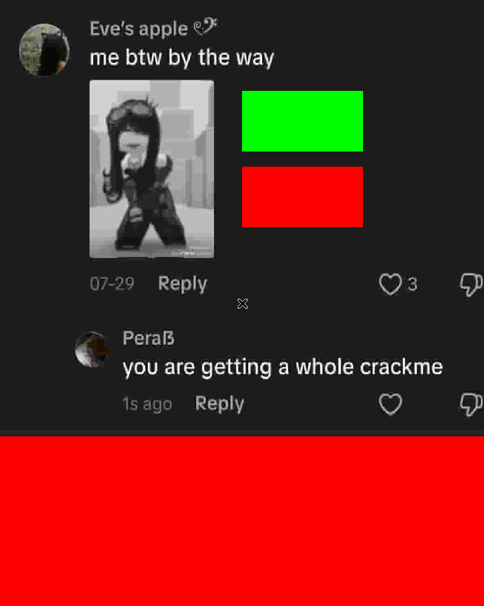
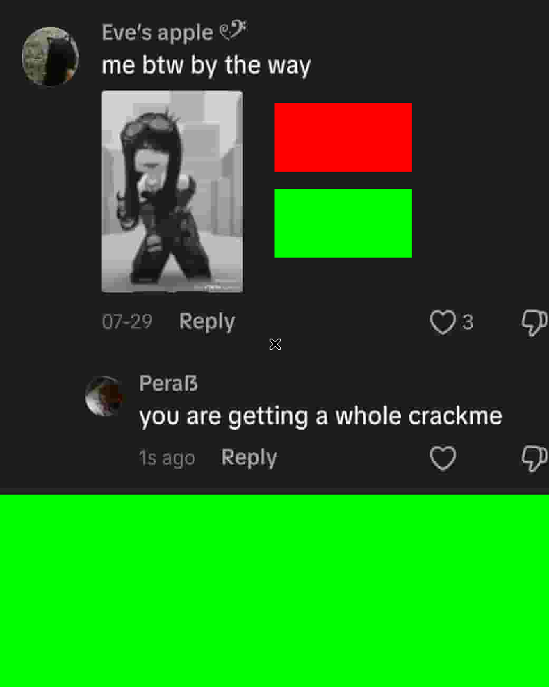
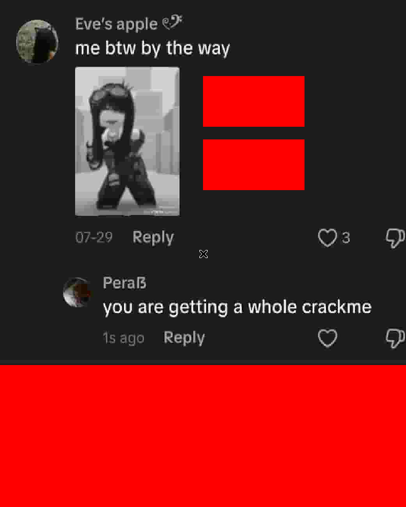

# Pera — Pera's Tiktok comment crackme

> **Origine** : [`ORIGIN.yml`](ORIGIN.yml) · [crackmes.one](https://crackmes.one/crackme/6a937f87cab6678aefe9dbc2) · id `6a937f87cab6678aefe9dbc2`

Crackme **ELF64** GUI (SDL2 + SDL2_image), satire du trend TikTok « screenshot a comment → make something of it ». **Double crackme** : deux barres vert/rouge, activées **séparément**. Auteur : [Pera](https://crackmes.one/user/Pera).

Dossier : `authors/pera/6a937f87cab6678aefe9dbc2/` — [famille](../README.md) · [repo](../../../README.md).

| Fichier | Rôle |
|---|---|
| [`thisismebtw`](original/thisismebtw) | binaire d’origine |
| [`README.md`](README.md) | ce write-up |
| [`tiktok-comment-solve.py`](tools/tiktok-comment-solve.py) | solveur (part1 + part2) |
| [`thisismebtw.i64.c`](analysis/thisismebtw.i64.c) | Hex-Rays brut (`decc`) |
| [`thisismebtw-clean.c`](analysis/thisismebtw-clean.c) | même logique, C lisible |
| [`embedded.jpg`](analysis/embedded.jpg) | JPEG embarqué (commentaire TikTok) |
| [`screenshot-part1.png`](analysis/screenshot-part1.png) | barre haute verte |
| [`screenshot-part2.png`](analysis/screenshot-part2.png) | barre basse verte |
| [`screenshot-fail.png`](analysis/screenshot-fail.png) | les deux rouges |

## Réponse

« Double crackme » → **deux solutions indépendantes** (impossible d’avoir les deux barres vertes en même temps : la partie 2 n’est évaluée que si la partie 1 échoue).

| Partie | Barre | Exemple | Effet |
|---|---|---|---|
| **1** | haute | text=`ach6` · passwrd=`xxxx` (peu importe) | vert / rouge |
| **2** | basse | text=**`petik`** · passwrd=**`aadp0`** | rouge / vert |

```bash
python3 tools/tiktok-comment-solve.py -q
# ach6
# petik aadp0

# live (dépendances : libSDL2 + libSDL2_image)
./original/thisismebtw ach6 xxxx      # barre haute verte
./original/thisismebtw petik aadp0    # barre basse verte

python3 tools/tiktok-comment-solve.py --check
# part1/part2/fail via gdb → OK
```

Autres passwords pour `petik` : `aadp8`, `aadt0`, … (même prédicat).

---

## 1. Premier regard

```text
file original/thisismebtw
# ELF 64-bit LSB pie executable, x86-64, dynamically linked, not stripped

diec → GCC 16.1.1 · GLIBC · SDL
sha256: 701aa77abd2ae09857183b49d099f4c1ff707923dec9dbe2f04031684e9a181f
```

```text
Usage: %s [text] [passwrd]
Crackme Comment          # titre fenêtre SDL
IMG_LoadTexture_RW       # JPEG en .rodata
```

Source `thisismebtw.c` dans les strings. Labels site (*String encryption*, *XOR*, *custom hash*) : surtout le hash custom + XOR des accumulateurs.

JPEG embarqué (`analysis/embedded.jpg`) : screenshot TikTok « leaked GTA 6 » + reply *« make a crackme based off this comment »* — le gag du challenge.

---

## 2. Flow

```text
main(argc, argv)
  si argc != 3 → Usage ; return 1
  memcpy(buf, jpeg_rodata, 0x2CA4)
  SDL_Init / CreateWindow(800×1000) / CreateRenderer
  IMG_LoadTexture_RW(buf) → fond TikTok
  ---- prédicats ----
  v11 = check_hash(argv[1])                 # barre haute
  si !v11 && same_len>3 :
      accum XOR/ADD sur (text, passwrd)
  v12 = !v11 && same_len>3 && (b^a)%0x539==42   # barre basse
  ---- boucle SDL ----
  PollEvent (QUIT) ; blit texture ;
  FillRect haute : vert si v11 sinon rouge
  FillRect basse : vert si v12 sinon rouge
```

Pas de message « Good job » console : la preuve est visuelle (ou les flags en mémoire).

---

## 3. Prédicat

### Partie 1 — hash type djb2 modifié

```c
uint32_t h = 5381;
size_t n = strlen(text);
for (i = 0; i < n; ++i)
    h = n + ((33 * h) ^ (uint8_t)text[i]);   // wrap 32-bit
ok = (n > 3) && ((h ^ 0x7FADBEEF) % 0x26F5 == 42);
```

Ex. `ach6`, `acjt`, `ae4t`, …

### Partie 2 — double accumulateur

Préconditions : `!ok_part1`, `len(text) == len(passwrd) > 3`.

```c
uint32_t a = 0, b = 0;
for (j = 0; j < n; ++j) {
    a = ((text[j] ^ pass[j]) + a) ^ 0x55;          // xor eax, 0x55
    uint32_t s = text[j] + pass[j] + b;
    b = (s & ~0xFFu) | ((s & 0xFF) ^ 0xAA);        // xor al, 0xAA
}
ok = ((b ^ a) % 0x539 == 42);
```

Avec text=`petik` → passwrd=`aadp0` (parmi d’autres).

Hex-Rays brut : [`analysis/thisismebtw.i64.c`](analysis/thisismebtw.i64.c) (`bash -ic 'decc original/thisismebtw'`).  
Version propre (noms / prédicats) : [`analysis/thisismebtw-clean.c`](analysis/thisismebtw-clean.c).

---


## Debug GDB (pas à pas)

ELF64 **PIE** + SDL, non strippé. Entry file `0x1150`, `main` `0x1249`. Live : base typique `0x555555554000` → `main` `@0x555555555249`.

```bash
export DEBUGINFOD_URLS=
gdb -nx -q ./original/thisismebtw
(gdb) set debuginfod enabled off
(gdb) break main
(gdb) run
(gdb) info proc mappings
# part1 : hash (h^0x7FADBEEF)%0x26F5 == 42 → ach6
# part2 : accum XOR username petik → aadp0
```

SDL / fenêtres : preuve UI hors GDB avec `xvfb-run -a` ; sous GDB, BP dans `main` après les checks texte.

`solution_summary` : part1 `ach6` ; part2 `petik`→`aadp0`.

## 4. Vérification

| Commande | v11 (haute) | v12 (basse) |
|---|---|---|
| `ach6 xxxx` | 1 | 0 |
| `petik aadp0` | 0 | 1 |
| `petik aaaaa` | 0 | 0 |

```bash
python3 tools/tiktok-comment-solve.py --check
# part1: ach6 xxxx -> v11=1 v12=0 OK
# part2: petik aadp0 -> v11=0 v12=1 OK
# fail:  petik aaaaa -> v11=0 v12=0 OK
```

Live (Xvfb + `SDL_RENDER_DRIVER=software`) :







Déps runtime : `libSDL2-2.0.so.0`, `libSDL2_image-2.0.so.0` (JPEG).

---

## 5. Notes

- Ce n’est **pas** un keygen name→serial classique : deux prédicats séparés, UI only.
- Les deux verts **en même temps** sont exclus par construction (`v12` exige `!v11`) — voulu pour le « double crackme ».
- Règles auteur (page crackmes.one) : pas de patch ; expliquer *comment* (ce write-up).
- x64dbg/x32dbg : N/A (ELF Linux) ; preuve = gdb flags + screenshots Xvfb.
