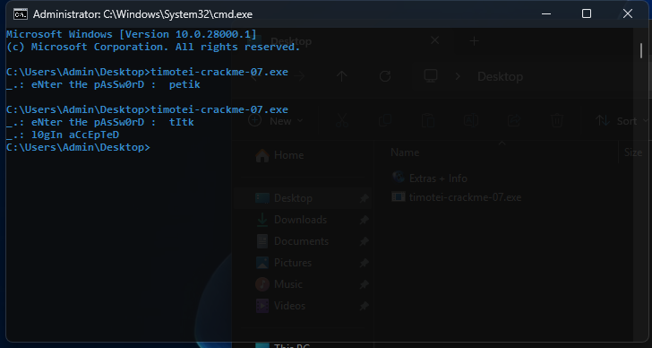

# timotei-crackme-07

> **Origine** : [`ORIGIN.yml`](ORIGIN.yml) · [crackmes.one](https://crackmes.one/crackme/64764cee33c5d439389134f2) · id `64764cee33c5d439389134f2`


Crackme **PE32 console**, MASM32, **self-modifying code**.
Auteur : timotei (crackmes.one). Mot de passe console (pas de keyfile).

Dossier : `authors/timotei/64764cee33c5d439389134f2/` — [série](../README.md) · [repo](../../../README.md).

| Fichier | Rôle |
|---|---|
| [`timotei-crackme-07.exe`](original/timotei-crackme-07.exe) | binaire d’origine |
| [`README.md`](README.md) | ce write-up |
| [`timotei-crackme-07-solve.py`](tools/timotei-crackme-07-solve.py) | SMC / famille `tI**` (section 6) |
| [`timotei-crackme-07.c`](tools/timotei-crackme-07.c) | prédicat C (section 8) |
| [`timotei-crackme-07-idapro.asm`](analysis/timotei-crackme-07-idapro.asm) | listing IDA (section 8) |
| [`timotei-crackme-07-masm.asm`](tools/timotei-crackme-07-masm.asm) | source reconstruit MASM32 (section 9) |
| [`screenshot01.png`](analysis/screenshot01.png) | live cmd : `petik` échoue, `tItk` réussit (section 5) |
| [`screenshot02.png`](analysis/screenshot02.png) | x64dbg avant le XOR, buffer `petik\r\n` (section 4) |

Réponse acceptée (famille) :

| Input | Valeur | Rôle |
|---|---|---|
| console | n’importe quel mot dont les **2 premiers** caractères sont `tI` | ex. `tIme`, `tItk`, `tI!!` |
| | seuls les **4 premiers** octets du buffer entrent dans le XOR | `tItk\r\n` → dword `tItk` |

Preuve live (VM) : voir [screenshot01.png](analysis/screenshot01.png).

---

## 1. Premier regard

```
file timotei-crackme-07.exe
# PE32 console, 3 sections, 2560 octets

diec → MASM 6.14 / masm32 / link 5.12
```

Imports `kernel32` seulement : `VirtualProtect`, `GetStdHandle`, `WriteConsoleA`, `ReadConsoleA`, `ExitProcess`. Plus de keyfile.

| VA | Texte |
|---|---|
| `0x403000` | `_.: eNter tHe pAsSw0rD : ` |
| `0x40301A` | `_.: l0gIn aCcEpTeD ` |
| `0x40302E` | buffer clavier (après `ReadConsole`) |

Hashes : MD5 `f86db33aefb6c60ec1e4e35d4be3cc2c`, SHA256 `45b99bffdb6f2f99b3b571f395a71d92106b5db95e8541e10f91989eb1c96e58`.

---

## 2. Flow global

```
start
    VirtualProtect(0x401000, 0x3E8, PAGE_EXECUTE_READWRITE, &old)
        ; .text inscriptible (0x40 = PAGE_EXECUTE_READWRITE)

    stdout = GetStdHandle(STD_OUTPUT_HANDLE)   ; -11 = 0xFFFFFFF5
    stdin  = GetStdHandle(STD_INPUT_HANDLE)    ; -10 = 0xFFFFFFF6

    WriteConsoleA(stdout, prompt @ 403000, 0x1A)
    ReadConsoleA(stdin, buffer @ 40302E, 0x64, &nread, 0)

    eax = dword [buffer]                       ; 4 premiers caractères (LE)
    xor  dword [0x40106B], eax                 ; SMC

    ; ── le CPU exécute le code patché à 0x40106B ──

    ; si « jmp short 0x40107C » (password tI**) :
    WriteConsoleA(stdout, success @ 40301A, 0x14)
    ExitProcess(0)

    ; sinon (ex. petik) :
    push 0 / call ExitProcess                  ; @ 0x401075
    ; ou instruction illégale → crash
```

Pas de `strcmp`. Le mot de passe **est** la clé XOR du code.

---

## 3. Self-modifying code

Sur disque, à `0x40106B` :

```
9F 46 90 90
```

`objdump` / x64dbg affichent n’importe quoi (`lahf` / `inc esi` / `nop`…) : c’est du **cipher**, pas le vrai flux.

```
401060  mov  eax, [0x40302E]         ; 4 premiers octets du password
401065  xor  dword [0x40106B], eax   ; patch en place
; EIP tombe sur 0x40106B
```

Suite **non chiffrée** :

```
40106F  xor  al, 0x0C
401071  sub  al, 0x22
401073  xor  al, 0x38
401075  push 0
401077  call ExitProcess             ; échec par défaut
40107C  WriteConsoleA(... success) ; but
401092  ExitProcess(0)
```

Les 4 octets déchiffrés doivent **sauter** `0x401075` → `0x40107C`.

### Saut court

```
40106B: EB 0F xx xx
```

- `EB` = `jmp rel8`
- cible = `0x40106D + 0x0F` = **`0x40107C`**
- `xx xx` jamais exécutés

### Quelle clé ?

```
9F 46 90 90  XOR  p0 p1 p2 p3  =  EB 0F ?? ??
```

| | calcul | résultat |
|---|---|---|
| p0 | `9F ^ EB` | `0x74` = **`t`** |
| p1 | `46 ^ 0F` | `0x49` = **`I`** |
| p2, p3 | libres | ex. `t` `k` → **`tItk`** (live), ou `me` → `tIme` |

Tout buffer dont les 4 premiers octets commencent par `tI` gagne.  
Variante near `E9 0C 00 00` → password `vJ\x90\x90` (moins pratique).

### `VirtualProtect` — à quoi ça sert ici

Il ne sert **qu’à rendre le code inscriptible** le temps du patch. Ce n’est pas un anti-debug, ni un cache mémoire.

Sur un PE Windows, `.text` est mappée **RX** (lecture + exécution), **pas** en écriture. Or le crackme fait :

```
xor dword ptr [0x40106B], eax
```

C’est une **écriture au milieu du code**. Sans changer les droits de la page, le CPU lève une **access violation** et le process meurt avant d’exécuter le saut.

D’où l’appel tout au début de `start` :

```
VirtualProtect(
    0x401000,   ; début de la zone code (.text)
    0x3E8,      ; taille (~1 Ko, largement assez pour couvrir 40106B)
    0x40,       ; PAGE_EXECUTE_READWRITE = R + X + W
    &oldProtect ; 0x403102 — ancien protect (non relu ensuite)
)
```

| | Sans `VirtualProtect` | Avec (`0x40` = RWX) |
|---|---|---|
| Droits `.text` | RX | R+W+X sur cette plage |
| `xor` sur `40106B` | **crash** (AV) | écriture OK |
| suite | — | CPU **exécute** les 4 octets patchés (`EB 0F…` si `tI**`) |

Le `X` reste : après le `xor`, le CPU doit pouvoir **exécuter** le `jmp` déchiffré. Le `W` n’est là que pour le self-modifying code.

En x64dbg : le `VirtualProtect` est le tout premier `call` utile (`401011`). On peut le passer (F8 / F9 jusqu’à `401060`) : l’intérêt pédagogique est surtout le couple **`401065` + dump `40106B`**.

---

## 4. Live x64dbg (screenshot02)

![x64dbg arrêté sur mov eax,[buffer], password petik](analysis/screenshot02.png)

Situation sur [screenshot02.png](analysis/screenshot02.png) :

| Élément | Valeur |
|---|---|
| EIP / break | **`401060`** `mov eax, dword ptr [40302E]` — **avant** le XOR |
| Commentaire dump | `40302E:"petik\r\n"` — `ReadConsole` a collé CR/LF |
| Prochaine SMC | `401065` `xor dword ptr [40106B], eax` |
| `40106B` (encore chiffré) | affiché `lahf` / `inc esi` / `nop` = **`9F 46 90 90`** |
| Échec | `401075` `push 0` / `ExitProcess` |
| Succès | `40107C` `WriteConsoleA` → `40301A` « l0gIn aCcEpTeD » |

Avec **`petik`**, les 4 premiers octets sont **`peti`** (le `k` est le 5ᵉ, hors XOR) :

| Offset buffer | Char | Hex |
|---|---|---|
| +0 | `p` | `70` |
| +1 | `e` | `65` |
| +2 | `t` | `74` |
| +3 | `i` | `69` |
| +4 | `k` | `6B` — **ignoré** par le `mov eax, [buffer]` |
| +5… | `\r\n` | fin de ligne console |

`EAX` (LE) ≈ `0x69746570`. Après le `xor` à `401065`, `40106B` **ne** devient **pas** `EB 0F` → pas de saut vers le succès.

### Recette x64dbg (5 minutes)

**Mauvais password (déjà sur le screenshot) :**

1. Break sur **`401060`** (ou `401065`)
2. Noter dump **`40106B`** : `9F 46 90 90`
3. **F8** le `mov` → **EAX** = `peti…`
4. **F8** le `xor` → dump **`40106B`** : bruit, pas `EB 0F`
5. Continuer → `ExitProcess` sans message de login

**Bon password (`tItk` / `tIme`) :**

1. Restart (`Ctrl+F2`), run, taper **`tItk`**
2. Break **`401065`**
3. **EAX** = `74 49 74 6B` → `t` `I` `t` `k`
4. **F8** le `xor`
5. Dump **`40106B`** : **`EB 0F ?? ??`** (`jmp short` → `40107C`)
6. Break optionnel sur **`40107C`** → `WriteConsole` succès

Comparer côte à côte les deux dumps de `40106B` (avant/après XOR, `petik` vs `tItk`) : c’est tout le crackme.

---

## 5. Vérification live (screenshot01)



Sur [screenshot01.png](analysis/screenshot01.png) (Windows 10, `cmd`) :

```
C:\Users\Admin\Desktop>timotei-crackme-07.exe
_.: eNter tHe pAsSw0rD :  petik
C:\Users\Admin\Desktop>timotei-crackme-07.exe
_.: eNter tHe pAsSw0rD :  tItk
_.: l0gIn aCcEpTeD
```

| Essai | Préfixe | Résultat |
|---|---|---|
| `petik` | `pe` | silence (retour au prompt) |
| `tItk` | **`tI`** | `_.: l0gIn aCcEpTeD` |

### Prédicat hors Windows

```bash
python3 timotei-crackme-07-solve.py
# tIme / tI!! / tItk → OK ; fail / petik → no

gcc -O0 -o /tmp/cm07 timotei-crackme-07.c
/tmp/cm07 tItk
# _.: l0gIn aCcEpTeD
```

Wine : `ReadConsoleA` veut une vraie console → `wineconsole` plutôt qu’un pipe.

---

## 6. Solveur Python

[`timotei-crackme-07-solve.py`](tools/timotei-crackme-07-solve.py)

| Fonction | Rôle |
|---|---|
| `decrypt(pw)` | `DISK XOR pw[0:4]` |
| `is_success_jmp(dec)` | `dec[:2] == EB 0F` |
| `password_ok(pw)` | prédicat (`tI**`) |
| `explain(pw)` | trace du XOR |
| `run_wine` | essai live (console) |

---

## 7. Récap des adresses

| VA | Quoi |
|---|---|
| `0x401000` | `VirtualProtect` |
| `0x40103F` | `WriteConsoleA` prompt |
| `0x40105B` | `ReadConsoleA` |
| `0x401060` | `mov eax, [buffer]` — break x64dbg utile |
| `0x401065` | `xor dword [0x40106B], eax` — SMC |
| `0x40106B` | code chiffré → `EB 0F` si `tI**` |
| `0x401075` | `ExitProcess` (échec) |
| `0x40107C` | `WriteConsoleA` succès |
| `0x403000` | prompt |
| `0x40301A` | succès |
| `0x40302E` | buffer (`"petik\r\n"` / `"tItk\r\n"`) |

---

## 8. Listing IDA + C à la main

| Fichier | Origine |
|---|---|
| [`timotei-crackme-07-idapro.asm`](analysis/timotei-crackme-07-idapro.asm) | export IDA (Intel) |
| [`timotei-crackme-07.c`](tools/timotei-crackme-07.c) | prédicat C |

Hashes IDA = binaire : MD5 `F86DB33A…`, SHA256 `45B99BFF…`.

IDA voit le SMC correctement :

```
mov  eax, dword_40302E
xor  ds:dword_40106B, eax
dword_40106B  dd 9090469Fh      ; blob chiffré (LE)
xor  al, 0Ch                    ; fallthrough échec
…
call ExitProcess
push … aL0ginAccepted           ; succès (après le jmp)
```

`dd 9090469Fh` = octets `9F 46 90 90` — même cipher que §3.

Prédicat C :

```c
/* DISK = 9F 46 90 90 */
dec[i] = DISK[i] ^ password[i];
return dec[0] == 0xEB && dec[1] == 0x0F;  /* ⇒ password[0:2] == "tI" */
```

---

## 9. Source reconstruit MASM32

Pas le fichier auteur. DIE dit **MASM32** ; le listing IDA + le PE permettent une reconstruction lisible.

Fichier : [`timotei-crackme-07-masm.asm`](tools/timotei-crackme-07-masm.asm)

```asm
invoke  VirtualProtect, offset start, 3E8h, PAGE_EXECUTE_READWRITE, offset oldProt
; …
mov     eax, dword ptr buffer
xor     dword ptr smc, eax
smc:
    dd  9090469Fh          ; "tI??" → EB 0F ?? ?? → jmp good
    xor al, 0Ch            ; fail path (13 o jusqu'à good)
    sub al, 22h
    xor al, 38h
    push 0
    call fail_exit
good:
    ; WriteConsole success
```

Compiler sous Windows (MASM32) :

```
\masm32\bin\ml /c /coff timotei-crackme-07-masm.asm
\masm32\bin\link /SUBSYSTEM:CONSOLE /OUT:timotei-crackme-07-masm.asm.exe timotei-crackme-07.obj
```

Le `dd 9090469Fh` est calé pour la **géométrie du PE d’origine** (13 octets entre la fin du dword et `good`, pour que `EB 0F` tombe juste). Un `ml`/`link` moderne peut décaler les VA : dans ce cas, recalculer

```
disk_bytes = (EB 0F 90 90) XOR password   ; ex. password "tI\0\0"
```

ou vérifier au debugger comme en §4.

---

## 10. Notes

- **MASM32** (DIE). IDA / Hex-Rays disent souvent « Visual C++ » à tort.
- Les `xor al` / `sub al` sous le blob ne s’exécutent **que** si on ne saute pas : bruit / fail path.
- `ReadConsole` ajoute `\r\n` : `tItk\r\n` → dword XOR = `tItk` ; le `\r` est en 5ᵉ position.
- `petik\r\n` → dword = **`peti`** — le `k` ne participe pas au SMC (screenshot02).
