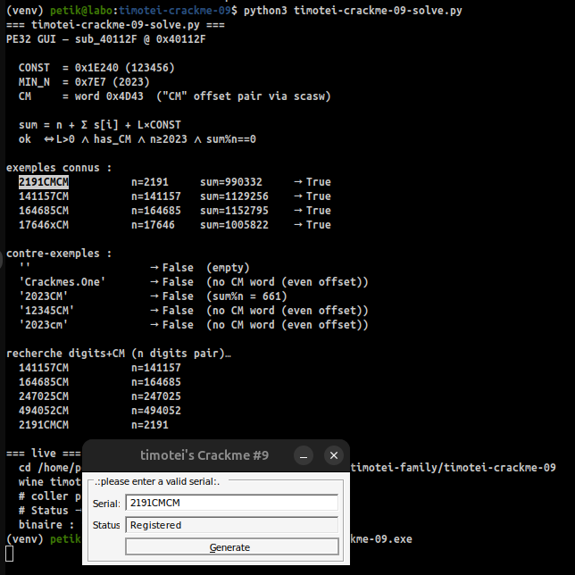
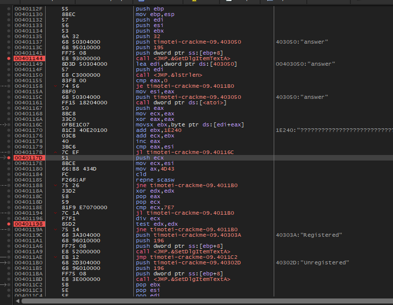

# timotei-crackme-09

> **Origine** : [`ORIGIN.yml`](ORIGIN.yml) · [crackmes.one](https://crackmes.one/crackme/649dbf9f33c5d460c17f1ec2) · id `649dbf9f33c5d460c17f1ec2`


Crackme **PE32 GUI**, MASM32, **serial** (dialog + bouton Generate).
Auteur : timotei (crackmes.one). Pas de keyfile : un champ Serial + Status.

Dossier : `authors/timotei/649dbf9f33c5d460c17f1ec2/` — [série](../README.md) · [repo](../../../README.md).

| Fichier | Rôle |
|---|---|
| [`timotei-crackme-09.exe`](original/timotei-crackme-09.exe) | binaire d’origine |
| [`README.md`](README.md) | ce write-up |
| [`timotei-crackme-09-solve.py`](tools/timotei-crackme-09-solve.py) | prédicat + exemples (section 6) |
| [`timotei-crackme-09.c`](tools/timotei-crackme-09.c) | prédicat C (section 8) |
| [`timotei-crackme-09-serializer-console-nasm.asm`](tools/timotei-crackme-09-serializer-console-nasm.asm) | keygen console NASM64 (section 9) |
| [`timotei-crackme-09-serializer-console-nasm.bin`](tools/timotei-crackme-09-serializer-console-nasm.bin) | binaire keygen (ELF64) |
| [`timotei-crackme-09-serializer-gui-fasm.asm`](tools/timotei-crackme-09-serializer-gui-fasm.asm) | keygen GUI FASM PE32 (section 9) |
| [`timotei-crackme-09-serializer-gui-fasm.bin`](tools/timotei-crackme-09-serializer-gui-fasm.bin) | binaire keygen GUI (PE32) |
| [`fasm_include/`](tools/fasm_include/) | headers FASM minimaux pour le GUI (section 9) |
| [`timotei-crackme-09-idapro.asm`](analysis/timotei-crackme-09-idapro.asm) | listing IDA (section 8) |
| [`timotei-crackme-09-idapro.c`](analysis/timotei-crackme-09-idapro.c) | Hex-Rays 9.4 (section 8) |
| [`screenshot01.png`](analysis/screenshot01.png) | x64dbg sur `sub_40112F` (section 5) |
| [`screenshot02.png`](analysis/screenshot02.png) | live GUI : `2191CMCM` → Registered (section 5) |

## Réponse (famille)

| Input | Valeur | Rôle |
|---|---|---|
| champ **Serial** | n’importe quelle chaîne passant le prédicat | ex. **`2191CMCM`**, `141157CM`, `164685CM` |
| action | bouton **&Generate** (ou check à l’init) | `sub_40112F` |
| Status | **Registered** | succès |

Il n’y a pas un unique serial : `n ≥ 2023`, sous-chaîne **`CM`** à offset pair, et `sum % n == 0`.

Preuve live : [screenshot02.png](analysis/screenshot02.png) — Serial **`2191CMCM`**, Status **Registered**.

---

## 1. Premier regard

```
file timotei-crackme-09.exe
# PE32 executable (GUI) Intel 80386, 4 sections, 6656 octets

diec → MASM 6.14 / masm32 / link 5.12
```

Imports :

| DLL | APIs |
|---|---|
| user32 | `DialogBoxParamA`, `GetDlgItemTextA`, `SetDlgItemTextA`, `SendDlgItemMessageA`, … |
| kernel32 | `GetModuleHandleA`, `lstrlenA`, `ExitProcess` |
| comctl32 | `InitCommonControls` |
| msvcrt | **`atoi`** |

Chaînes : `.:please enter a valid serial:.`, `Crackmes.One`, `Unregistered`, `Registered`, titre ressource `timotei's Crackme #9`.

Hashes : MD5 `d750491b5c6bd079c2d3f789371d9eda`, SHA256 `d7b95a6613c6339e1718fedda458c1da6ee693eab540e3fe1465c79bea249982`.

---

## 2. Flow global

```
start @ 401000
    InitCommonControls
    GetModuleHandleA / LoadIcon(0xC8) / LoadCursor(IDC_ARROW)
    DialogBoxParamA(hInst, template 0x64, DialogFunc @ 40104F)
    ExitProcess(0)

DialogFunc:
    WM_INITDIALOG (0x110)
        subclass edit (GWL_WNDPROC → 4010F8) pour SetCursor
        EM_LIMITTEXT 0x31 sur id 405
        SetDlgItemText(400, "please enter…")
        SetDlgItemText(405, "Crackmes.One")   ; défaut dans Serial
        sub_40112F(hWnd)                      ; check immédiat

    WM_COMMAND (0x111), wParam == 402         ; &Generate
        sub_40112F(hWnd)

    WM_CLOSE (0x10)
        EndDialog
```

| ID contrôle | Déc | Rôle |
|---|---|---|
| `0x190` | 400 | libellé prompt |
| `0x195` | **405** | champ Serial |
| `0x196` | **406** | Status |
| `0x192` | **402** | bouton Generate |

Toute la validation = **`sub_40112F` @ `0x40112F`**.

---

## 3. Le prédicat (`sub_40112F`) — en détail

Il n’y a **pas** de `strcmp` avec un serial fixe en dur : le programme lit le champ, calcule un **score**, impose un **motif** (`CM`) et un **seuil** sur `atoi`, puis exige que le score soit **divisible** par `atoi` ; si une étape échoue → Status **Unregistered** (pas de crash, pas de MessageBox).

Toute la logique tient dans **`sub_40112F`** (`0x40112F` ; IDA + Hex-Rays §8).

### 3.1 Vue d’ensemble

```text
buffer = texte du champ Serial (id 405)
L      = lstrlen(buffer)
si L == 0                    → Unregistered

n      = atoi(buffer)          ; préfixe numérique seulement
sum    = n
pour chaque caractère s[i] :
    sum += movsx(s[i]) + 0x1E240     ; + 123456

si "CM" absent (scan words)  → Unregistered
si n < 2023                  → Unregistered
si sum % n != 0              → Unregistered
sinon                        → Registered
```

Quatre freins indépendants : **non vide**, **motif CM**, **plancher 2023**, **divisibilité**.

### 3.2 Lecture du champ

```asm
push    32h                 ; cchMax = 50
push    offset byte_403050  ; buffer @ 0x403050
push    195h                ; id 405 = Serial
push    [ebp+hDlg]
call    GetDlgItemTextA

lea     edi, byte_403050
push    edi
call    lstrlenA
cmp     eax, 0
jz      loc_Unregistered    ; chaîne vide
mov     esi, eax            ; esi = L
```

| Détail | Effet |
|---|---|
| `cchMax = 50` (`0x32`) | au plus 49 caractères + NUL copiés |
| `EM_LIMITTEXT 0x31` (init) | l’UI limite encore un peu plus la saisie |
| buffer en `.data` / BSS | zone zéroée : `scasw` peut lire un peu au-delà du NUL sans garbage |
| `lstrlen == 0` | échec immédiat (pas la peine d’aller plus loin) |

Le champ est prérempli **`Crackmes.One`** à l’init : ce n’est **pas** un serial valide (`atoi` → 0, pas de `CM`).

### 3.3 `atoi` : d’où vient `n`

```asm
push    offset byte_403050
call    ds:atoi             ; msvcrt
push    eax                 ; sauve n sur la pile (réutilisé plus tard)
mov     ecx, eax            ; ecx = n  (accumulateur de départ)
```

`atoi` (comportement C classique) :

- lit un préfixe optionnel `+`/`-` puis des **chiffres** ;
- s’arrête au premier non-chiffre ;
- sans chiffre → **0**.

Exemples :

| Serial | `atoi` → `n` | Commentaire |
|---|---|---|
| `2191CMCM` | `2191` | s’arrête sur `C` |
| `2023CM` | `2023` | idem |
| `Crackmes.One` | `0` | pas de digit en tête |
| `CM2023` | `0` | commence par `C` |
| `0042CM` | `42` | zéros de tête OK, mais 42 < 2023 → fail plus bas |

`n` sert **deux** fois : base de la somme, puis diviseur du test final.

### 3.4 Boucle de somme + constante `0x1E240`

```asm
xor     eax, eax            ; i = 0
loc_40116C:
movsx   ebx, byte ptr [edi+eax]   ; s[i] sign-étendu en 32 bits
add     ebx, 1E240h               ; + 123456  (IMMÉDIAT)
add     ecx, ebx                  ; sum += …
inc     eax
cmp     eax, esi                  ; i < L ?
jl      short loc_40116C
push    ecx                       ; sauve sum sur la pile
```

Points importants :

1. **`add ebx, 1E240h`** — encodage `81 C3 40 E2 01 00` : c’est une **constante immédiate** `0x1E240 = 123456`, **pas** un accès mémoire / table XOR. Les listings qui affichent `ds:1E240` + `????` sont trompeurs (cf. [screenshot01.png](analysis/screenshot01.png)).

2. **`movsx`** — pour de l’ASCII printable (`0x20`–`0x7E`) le bit de signe est 0 : équivalent à « ajouter le code ASCII ».

3. **Chaque caractère**, y compris ceux après le préfixe numérique (`C`, `M`, `x`, …), entre dans la somme. Ce n’est pas « que les digits ».

4. La boucle tourne **`L` fois** (`esi = lstrlen`), pas `n` fois.

Formule :

```text
sum = n + Σ_{i=0}^{L-1} ( s[i] + 123456 )
    = n + Σ s[i] + L × 123456
```

On pousse `sum` sur la pile (`push ecx`) pour le récupérer **après** le scan `CM` (qui réutilise `ecx`).

### 3.5 Filtre `"CM"` — `repne scasw`

Après la boucle, `edi` pointe encore sur le **début** du buffer (seul `eax` a servi d’index). Le code cherche le **word** little-endian `0x4D43` :

```asm
mov     ecx, esi            ; nombre d’itérations = L  (pas L/2 !)
mov     ax, 4D43h           ; 'C' = 0x43, 'M' = 0x4D  → word 0x4D43
cld
repne   scasw               ; tant que ZF=0 et ecx>0 : cmp [edi], ax ; edi += 2
jnz     loc_Unregistered    ; pas trouvé
```

**Que fait `repne scasw` ?**

- lit un **mot 16 bits** à `es:edi` ;
- le compare à `ax` (`0x4D43` = caractères **`C` puis `M`** en mémoire) ;
- avance **`edi` de 2** (un word), décrémente `ecx` ;
- s’arrête si égalité **ou** `ecx == 0`.

Conséquences pratiques :

| Contrainte | Pourquoi |
|---|---|
| Il faut la sous-chaîne **`CM`** exacte | `0x4D43` = majuscules uniquement (`cm` → fail) |
| **`CM` à un offset pair** (0, 2, 4, …) | le scan ne regarde que les positions alignées word |
| `ecx` initial = **L** (longueur en caractères) | jusqu’à L comparaisons de words → peut lire un peu **après** le NUL dans le buffer zéroé |
| `CM` au milieu ou en double OK | dès qu’**un** word matche, on sort en succès pour cette étape |

Alignement :

```text
offset:  0  1  2  3  4  5  6  7
2023CM : 2  0  2  3  C  M         → word @4 = "CM"  ✓  (L=6 pair avant CM)
12345CM: 1  2  3  4  5  C  M      → "CM" @5 impair   ✗  (words @0,@2,@4,@6… rate CM)
2191CMCM:2  1  9  1  C  M  C  M   → "CM" @4 et @6    ✓
```

Astuce si le préfixe a un **nombre impair** de digits : insérer un filler d’1 caractère pour repousser `CM` sur un offset pair (`17646` + `x` + `CM`).

Hex-Rays reformule le scan ainsi (équivalent) :

```c
/* 19779 == 0x4D43 */
do {
    if (v7 == 0) break;
    v6 = (*(_WORD *)v1 == 19779);
    v1 += 2;
    --v7;
} while (!v6);
```

### 3.6 Seuil `2023` et test `sum % n == 0`

Pile à ce moment (après les deux `push`) :

```text
[ sommet ]  sum     ← push ecx après la boucle
[ dessous ] n       ← push eax juste après atoi
```

```asm
xor     edx, edx
pop     eax                 ; eax = sum
pop     ecx                 ; ecx = n
cmp     ecx, 7E7h           ; 0x7E7 = 2023
jl      loc_Unregistered    ; comparaisonsignée : n < 2023 → fail
div     ecx                 ; EAX = sum / n , EDX = sum % n   (DIV non signé)
test    edx, edx
jnz     loc_Unregistered    ; reste ≠ 0 → fail

push    offset aRegistered  ; "Registered"
push    196h                ; id 406 = Status
push    [ebp+hDlg]
call    SetDlgItemTextA
; sinon branche Unregistered (même API, autre chaîne)
```

| Instruction | Sens |
|---|---|
| `cmp ecx, 7E7h` / `jl` | `n` doit être **≥ 2023** (signé). Clin d’œil année 2023. |
| `div ecx` | division **entière non signée** 32 bits : `sum ÷ n`. |
| `test edx, edx` / `jnz` | le **reste** doit être **0** → `sum` est un multiple de `n`. |

Si `n == 0`, un vrai `DIV` par zéro crasherait ; en pratique `n < 2023` inclut déjà 0 → on sort avant le `div` via le `jl`.

### 3.7 Formule finale

En une ligne :

```text
succès  ⇔
    L > 0
 ∧  ∃ k pair,  s[k..k+1] == "CM"   (dans le scan scasw)
 ∧  n = atoi(s)  ≥  2023
 ∧  ( n + Σ s[i] + L×123456 )  %  n  ==  0
```

Simplification du modulo (car `n % n == 0`) :

```text
( Σ s[i] + L × 123456 )  %  n  ==  0
```

Autrement dit : la « charge » des caractères + la constante par caractère doit être un **multiple de `n`**. On ne contrôle pas `n` et la charge indépendamment : allonger la chaîne, changer des lettres ou le préfixe numérique modifie les deux côtés.

Pseudo-C (aligné sur le binaire) :

```c
int serial_ok(const char *s)
{
    int L = strlen(s);
    int n, i;
    unsigned sum;

    if (L == 0)
        return 0;
    n = atoi(s);
    sum = (unsigned)n;
    for (i = 0; i < L; i++)
        sum += (unsigned)((signed char)s[i] + 123456);

    if (!has_cm_word_scasw(s, L))  /* repne scasw 0x4D43 */
        return 0;
    if (n < 2023)
        return 0;
    return (sum % (unsigned)n) == 0;
}
```

### 3.8 Trace complète : `2191CMCM`

| Étape | Valeur |
|---|---|
| Serial | `2 1 9 1 C M C M` |
| `L` | 8 |
| `n = atoi` | **2191** (≥ 2023 ✓) |
| `"CM"` | offset 4 et 6, pairs ✓ |
| ASCII | 50+49+57+49+67+77+67+77 = **493** |
| `L × 123456` | 8 × 123456 = **987648** |
| `sum` | 2191 + 493 + 987648 = **990332** |
| `990332 % 2191` | **0** ✓ → **Registered** |

```text
sum = 990332
990332 ÷ 2191 = 452   reste 0
```

Preuve live : [screenshot02.png](analysis/screenshot02.png).

### 3.9 Contre-exemples (pourquoi ça rate)

| Serial | Où ça casse |
|---|---|
| *(vide)* | `L == 0` |
| `Crackmes.One` | pas de `CM` ; `n = 0` |
| `2023CM` | `CM` OK, `n = 2023` OK, mais **reste 661** (`sum % n ≠ 0`) |
| `12345CM` | `CM` à l’offset **5** (impair) → `scasw` ne le voit pas |
| `2023cm` | minuscules ≠ word `0x4D43` |
| `CM2023` | `atoi` = **0** → `n < 2023` |
| `2022CM` | `n = 2022 < 2023` |

### 3.10 Famille de solutions / exemples

Il n’y a **pas** un unique serial. Toute chaîne respectant les 4 conditions passe.

| Serial | `n` | Résultat |
|---|---|---|
| *(vide)* / `Crackmes.One` | 0 | Unregistered |
| `2023CM` | 2023 | Unregistered (reste 661) |
| `12345CM` | 12345 | Unregistered (CM impair) |
| **`2191CMCM`** | 2191 | **Registered** (validé live) |
| **`141157CM`** | 141157 | **Registered** |
| **`164685CM`** | 164685 | **Registered** |
| `17646xCM` | 17646 | Registered (`x` aligne CM) |

Forme simple pour en générer : `str(n) + "CM"` (ou `+"CMCM"`) avec **nombre pair de digits** dans `n` (pour que `CM` tombe pair), puis filtrer `sum % n == 0` — Python : [`timotei-crackme-09-solve.py`](tools/timotei-crackme-09-solve.py) ; NASM : [`timotei-crackme-09-serializer-console-nasm.asm`](tools/timotei-crackme-09-serializer-console-nasm.asm) (§9).

---

## 4. Contenu / indices culturels

- **`0x7E7` = 2023** : année du binaire / époque crackmes.one.
- **`CM`** : préfixe fréquent « crackme », ou initiales ; le `scasw` force le bigramme exact.
- **`0x1E240` = 123456** : constante « ronde », pas de table secrète.
- Champ prérempli **`Crackmes.One`** : `atoi` s’arrête tout de suite → 0 → Unregistered tant qu’on n’a pas Generate avec un bon serial.

---

## 5. Vérification

### Live GUI (screenshot02)



Sur [screenshot02.png](analysis/screenshot02.png) (dialog *timotei's Crackme #9*, solveur en arrière-plan) :

```
Serial : 2191CMCM
Status : Registered
```

La séquence du write-up / solveur est donc **validée en live**, pas seulement par le prédicat Python/C.

### x64dbg (screenshot01)



Sur [screenshot01.png](analysis/screenshot01.png) : désassemblage de **`sub_40112F`**, breakpoints sur l’appel `GetDlgItemTextA`, la boucle, et `test edx,edx` avant Registered / Unregistered.

Point d’attention sur la capture : `add ebx, 1E240` avec un commentaire type table `????` — c’est un **imm32**, encodage `81 C3 40 E2 01 00`.

### Prédicat hors Windows

```bash
python3 timotei-crackme-09-solve.py
python3 timotei-crackme-09-solve.py 2191CMCM 2023CM
gcc -O0 -o /tmp/cm09 timotei-crackme-09.c && /tmp/cm09
# 2191CMCM → Registered
/tmp/cm09 2023CM
# Unregistered
```

### Relancer le GUI

```bash
wine timotei-crackme-09.exe
# ou VM Windows / VirtualBox
# Serial : 2191CMCM  →  Generate  →  Status : Registered
```

### Serializers

```bash
# console NASM (Linux)
./timotei-crackme-09-serializer-console-nasm.bin
./timotei-crackme-09-serializer-console-nasm.bin 2191CMCM   # OK

# GUI FASM (Wine / Windows)
wine timotei-crackme-09-serializer-gui-fasm.bin   # Generate / Check
```

---

## 6. Solveur Python

[`timotei-crackme-09-solve.py`](tools/timotei-crackme-09-solve.py) — rejoue `atoi` / somme / `scasw` / modulo, liste des exemples, brute `digits+CM`.

```bash
python3 timotei-crackme-09-solve.py
python3 timotei-crackme-09-solve.py '141157CM'
```

---

## 7. Récap des adresses

| VA | Quoi |
|---|---|
| `0x401000` | `start` |
| `0x40104F` | `DialogFunc` |
| `0x4010F8` | subclass WndProc (curseur) |
| `0x40112F` | **`sub_40112F`** — validation serial |
| `0x40116C` | boucle `movsx` / `add 0x1E240` |
| `0x401180` | `mov ax, 4D43h` / `repne scasw` |
| `0x40118E` | `cmp ecx, 7E7h` / `div` / `test edx` |
| `0x40119C` | SetDlgItemText Registered |
| `0x4011B0` | SetDlgItemText Unregistered |
| `0x403000` | prompt |
| `0x403020` | `Crackmes.One` |
| `0x40302D` / `0x40303A` | Unregistered / Registered |
| `0x403050` | buffer serial |

---

## 8. Dumps IDA Pro (asm + Hex-Rays)

| Fichier | Origine |
|---|---|
| [`timotei-crackme-09-idapro.asm`](analysis/timotei-crackme-09-idapro.asm) | listing IDA |
| [`timotei-crackme-09-idapro.c`](analysis/timotei-crackme-09-idapro.c) | Hex-Rays 9.4 |
| [`timotei-crackme-09.c`](tools/timotei-crackme-09.c) | C à la main, juste le prédicat |

Hashes IDA = binaire : MD5 `D750491B…`, SHA256 `D7B95A66…`.

### Ça correspond

Hex-Rays écrit `sub_40112F` ainsi :

```c
GetDlgItemTextA(hDlg, 405, byte_403050, 50);
v3 = lstrlenA(byte_403050);
if (v3 == 0)
  return SetDlgItemTextA(hDlg, 406, aUnregistered);
v10 = atoi(byte_403050);
v4 = v10;
v5 = 0;
do {
  v4 += byte_403050[v5++] + 123456;
} while (v5 < v3);
/* scasw rejoué : *(_WORD *)v1 == 19779, v1 += 2 */
if (/* CM trouvé */ && v10 >= 2023 && v9 % v10 == 0)
  return SetDlgItemTextA(hDlg, 406, aRegistered);
else
  return SetDlgItemTextA(hDlg, 406, aUnregistered);
```

| Hex-Rays | Listing |
|---|---|
| `+ 123456` | `add ebx, 1E240h` |
| `19779` | `ax = 4D43h` (`"CM"`) |
| `v10 >= 2023` | `cmp ecx, 7E7h` / `jl` |
| `v9 % v10 == 0` | `div ecx` / `test edx,edx` |
| ids 405 / 406 / 402 | `195h` / `196h` / `192h` |

### Pièges

1. **« Compiler : Visual C++ »** — faux. DIE : MASM32 6.14.
2. **`1E240` vu comme adresse** dans certains listings — c’est un **imm**.
3. **`scasw`** : seuls les offsets **pairs** ; longueur impaire avant `CM` → fail.
4. **`DIV` non signé** : pour `n > 0` et sum positif (cas ASCII), `%` C usuel suffit.
5. **DB IDA** (`.id0` …) : non versionnés (`.gitignore`) ; seuls les exports `.asm` / `.c` le sont.

### C à la main

```c
n = atoi(s);
sum = n;
for (i = 0; i < L; i++)
    sum += (signed char)s[i] + 123456;
ok = has_cm_word(s) && n >= 2023 && (sum % n) == 0;
```

---

## 9. Serializers (keygen / check)

Même prédicat que `sub_40112F` : `atoi`, somme `+123456` / car., word `"CM"`, `n≥2023`, `sum%n==0`.

### 9.1 Console NASM64 (Linux)

Fichiers : [`timotei-crackme-09-serializer-console-nasm.asm`](tools/timotei-crackme-09-serializer-console-nasm.asm) → [`.bin`](tools/timotei-crackme-09-serializer-console-nasm.bin).

Pas de libc : `sys_write` / `sys_exit` (`ld -nostdlib`).

| Mode | Commande | Rôle |
|---|---|---|
| keygen | `./timotei-crackme-09-serializer-console-nasm.bin` | brute `n+"CM"` puis `n+"CMCM"` |
| check | `./…-nasm.bin <serial>` | `OK` / `FAIL` (exit 0/1) |

```bash
nasm -f elf64 -o timotei-crackme-09-serializer-console-nasm.o \
     timotei-crackme-09-serializer-console-nasm.asm
ld -nostdlib -static -no-pie -o timotei-crackme-09-serializer-console-nasm.bin \
     timotei-crackme-09-serializer-console-nasm.o
./timotei-crackme-09-serializer-console-nasm.bin
```

### 9.2 GUI FASM (PE32, Wine / Windows)

Fichiers : [`timotei-crackme-09-serializer-gui-fasm.asm`](tools/timotei-crackme-09-serializer-gui-fasm.asm) → [`.bin`](tools/timotei-crackme-09-serializer-gui-fasm.bin).

Dialog : champ **Serial**, **Status**, boutons **Generate** (remplit un serial valide + Registered) et **Check** (valide le texte saisi).

Headers minimaux dans [`fasm_include/`](tools/fasm_include/) (subset FASM `win32a` + macros `resource` / `proc32` / `import32`).

```bash
# fasm = flat assembler (fasm.x64 Linux ou fasm.exe)
fasm timotei-crackme-09-serializer-gui-fasm.asm \
     timotei-crackme-09-serializer-gui-fasm.bin
wine timotei-crackme-09-serializer-gui-fasm.bin
```

Ce n’est **pas** le crackme d’origine : outil pédagogique (keygen/check) avec le même prédicat.

---

## 10. Notes

- Premier GUI de la série timotei (#09–#12).
- `EM_LIMITTEXT 0x31` = 49 caractères utiles (+ NUL) ; `GetDlgItemText` accepte 50.
- Subclass de l’edit : seulement pour `WM_SETCURSOR` → curseur custom, pas de logique serial.
- Famille de serials large une fois la formule connue ; Python ou keygen NASM pour en générer.
