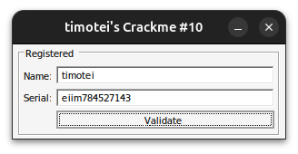

# timotei-crackme-10

> **Origine** : [`ORIGIN.yml`](ORIGIN.yml) · [crackmes.one](https://crackmes.one/crackme/64ac536033c5d460c17f221c) · id `64ac536033c5d460c17f221c`


Crackme **PE32 GUI**, MASM32, **Name + Serial**.
Auteur : timotei (crackmes.one).

Dossier : `authors/timotei/64ac536033c5d460c17f221c/` — [série](../README.md) · [repo](../../../README.md).

| Fichier | Rôle |
|---|---|
| [`timotei-crackme-10.exe`](original/timotei-crackme-10.exe) | binaire d’origine |
| [`README.md`](README.md) | ce write-up |
| [`timotei-crackme-10-solve.py`](tools/timotei-crackme-10-solve.py) | keygen Python : name → serial (section 6) |
| [`timotei-crackme-10-idapro.asm`](analysis/timotei-crackme-10-idapro.asm) | listing IDA (section 8) |
| [`timotei-crackme-10-serializer-gui-fasm.asm`](tools/timotei-crackme-10-serializer-gui-fasm.asm) | serializer GUI FASM (section 9) |
| [`timotei-crackme-10-serializer-gui-fasm.bin`](tools/timotei-crackme-10-serializer-gui-fasm.bin) | PE32 serializer |
| [`fasm_include/`](tools/fasm_include/) | headers FASM minimaux |
| [`screenshot01.png`](analysis/screenshot01.png) | live : `timotei` / `eiim784527143` → Registered (section 5) |

## Réponse (famille)

| Input | Valeur | Rôle |
|---|---|---|
| **Name** (login) | ≥ 4 caractères | ex. `timotei`, `petik` |
| **Serial** | dérivé du name trié | ex. **`eiim784527143`** pour `timotei` |
| action | bouton **&Validate** | `sub_401144` |

```bash
python3 timotei-crackme-10-solve.py timotei
# Serial : eiim784527143
```

Preuve live : [screenshot01.png](analysis/screenshot01.png).

---

## 1. Premier regard

```
file timotei-crackme-10.exe
# PE32 GUI, 9216 octets, 4 sections

diec → MASM 6.14 / masm32 / link 5.12
```

Imports : `DialogBoxParamA`, `GetDlgItemTextA`, `SetDlgItemTextA`, … + **`atoi`** (msvcrt).

UI ressource : `Name:`, `Serial:`, `&Validate`, titre `timotei's Crackme #10`.

Hashes : MD5 `7a45656539cc4e1b85fa35eee21e366b`, SHA256 `15af16b8a7b88b86691f7c1e72952bcd2bd31a919b00f37d044bf21aa650f32d`.

---

## 2. Flow global

```
start @ 401000
    InitCommonControls / icône / curseur
    DialogBoxParam(dialog 0x64, DialogFunc @ 40104F)

DialogFunc:
    WM_INITDIALOG (0x110)
        subclass edit (curseur)
        EM_LIMITTEXT 0x31 sur Name (405)
        prompt (400) ← ".::."
        Name   (405) ← "timotei"
        Serial (406) ← "CraCkMeS.oNe"
        call sub_401144          ; check immédiat (souvent Unregistered)

    WM_COMMAND (0x111), id 0x192  ; &Validate
        call sub_401144

    WM_MOUSEMOVE (0x200)         ; ★ « protection »
        EndDialog(0)             ; ferme la fenêtre
```

| ID | Déc | Rôle |
|---|---|---|
| `0x190` | 400 | libellé `.::.` → devient Registered / Unregistered |
| `0x195` | **405** | **Name** |
| `0x196` | **406** | **Serial** |
| `0x192` | **402** | bouton Validate |

Validation = **`sub_401144` @ `0x401144`**.

---

## 3. Protection souris (`WM_MOUSEMOVE`)

```asm
loc_4010F4:
cmp     [ebp+msg], 200h          ; WM_MOUSEMOVE
jnz     short loc_ret
push    0
push    [ebp+hWnd]
call    EndDialog                ; → le programme se ferme
```

Dès que la **procédure du dialog** reçoit un mouvement de souris (fond / marges de la fenêtre), elle appelle `EndDialog` : l’app disparaît. Ce n’est **pas** un anti-debug du serial.

Contournements : clavier (`Tab`, saisie, `Alt+V`) ; patch / BP sur `0x4010F4`–`0x401102` ; le serializer FASM **n’a pas** ce comportement.

---

## 4. Le prédicat (`sub_401144`) — en détail

Il n’y a **pas** de serial fixe : le Name est trié, les 4 premiers octets deviennent le préfixe du serial, et le suffixe numérique est la partie haute du **carré 64 bits** de ce dword.

### 4.1 Lecture

```asm
GetDlgItemTextA(hDlg, 196h, dword_403072, 32h)   ; Serial
jz  fail                                          ; vide

GetDlgItemTextA(hDlg, 195h, dword_403040, 32h)   ; Name
cmp eax, 4
jl  fail                                          ; len < 4
```

### 4.2 Tri à bulles du Name (en place)

```asm
; ebx = len-1
loc_401187:
mov  ecx, ebx
; pour chaque paire adjacente :
cmp  al, dl
jle  no_swap
; swap octets
loop …
dec  ebx
mov  esi, name
jnz  loc_401187
```

Les caractères du Name sont ordonnés en **ordre croissant ASCII** dans le buffer `0x403040`.

Exemple : `timotei` → **`eiimott`**.

### 4.3 Égalité des dwords + mul

```asm
mov  eax, dword_403040      ; name_d = 4 premiers octets triés (LE)
mov  edx, dword_403072      ; ser_d  = 4 premiers octets du serial
mov  ebx, eax
xor  ebx, edx
jnz  fail                    ; name_d doit == ser_d

mul  edx                     ; edx:eax = name_d * ser_d  (64 bits)
mov  edi, edx                ; high32
push offset byte_403076      ; Serial + 4
call atoi
xor  eax, edi
jnz  fail
→ SetDlgItemText(400, "Registered")
```

Comme `name_d == ser_d` :

```text
high32 = (name_d * name_d) >> 32 = (name_d²) >> 32
```

et **`atoi(Serial[4:])` doit valoir `high32`**.

### 4.4 Formule

```text
sorted = bubble_sort(Name)          # len(Name) ≥ 4
prefix = sorted[0:4]
d      = uint32_LE(prefix)
Serial = prefix + str( (d * d) >> 32 )
```

### 4.5 Exemples

| Name | sorted | Serial |
|---|---|---|
| `timotei` | `eiimott` | **`eiim784527143`** |
| `petik` | `eikpt` | `eikp828254537` |
| `abcd` / `dcba` | `abcd` | `abcd660458353` |
| `AAAA` | `AAAA` | `AAAA279065541` |

`dcba` et `abcd` partagent le même serial (même tri).

Trace `timotei` :

```text
sorted = eiimott
prefix = eiim
d      = 0x6d696965
d²     = … → high32 = 784527143
Serial = eiim784527143
```

---

## 5. Vérification

### Live GUI (screenshot01)



Sur [screenshot01.png](analysis/screenshot01.png) :

```
Registered
Name:   timotei
Serial: eiim784527143
```

### Solveur

```bash
python3 timotei-crackme-10-solve.py timotei
python3 timotei-crackme-10-solve.py petik
python3 timotei-crackme-10-solve.py --check timotei eiim784527143
```

### Crackme (attention souris)

```bash
wine timotei-crackme-10.exe
# préférer le clavier, ou patcher WM_MOUSEMOVE
```

---

## 6. Solveur Python

[`timotei-crackme-10-solve.py`](tools/timotei-crackme-10-solve.py) — **login en argument** → serial.

```bash
python3 timotei-crackme-10-solve.py <name>
python3 timotei-crackme-10-solve.py timotei -q    # serial seul
python3 timotei-crackme-10-solve.py --check NAME SERIAL
```

---

## 7. Récap des adresses

| VA | Quoi |
|---|---|
| `0x401000` | `start` |
| `0x40104F` | `DialogFunc` |
| `0x4010F4` | **`WM_MOUSEMOVE` → EndDialog** |
| `0x40110D` | subclass WndProc (curseur) |
| `0x401144` | **`sub_401144`** — validation |
| `0x401187` | boucle tri à bulles |
| `0x4011A7` | `mov eax,[name]` / `mul` / `atoi` |
| `0x403000` | `.::.` |
| `0x403005` | `timotei` |
| `0x40300D` | `CraCkMeS.oNe` |
| `0x40301A` / `0x403027` | Unregistered / Registered |
| `0x403040` | buffer Name |
| `0x403072` | buffer Serial |
| `0x403076` | Serial+4 (`atoi`) |

---

## 8. Dump IDA Pro

| Fichier | Origine |
|---|---|
| [`timotei-crackme-10-idapro.asm`](analysis/timotei-crackme-10-idapro.asm) | listing IDA |

Hashes IDA = binaire. « Compiler: Visual C++ » → faux (MASM32).

Le listing montre clairement :

- `cmp [msg], 200h` / `EndDialog` ;
- tri `loc_401187` / `loop loc_401189` ;
- `mul edx` + `atoi` sur `byte_403076` ;
- `SetDlgItemText` id `190h` pour Registered / Unregistered.

Pas de dump Hex-Rays `.c` dans ce dossier pour l’instant.

---

## 9. Serializer GUI FASM

Fichiers : [`timotei-crackme-10-serializer-gui-fasm.asm`](tools/timotei-crackme-10-serializer-gui-fasm.asm) → [`.bin`](tools/timotei-crackme-10-serializer-gui-fasm.bin).

| Élément | Rôle |
|---|---|
| **Name** | saisie login (défaut `timotei`) |
| **Serial** | lecture seule, **recalcul auto** à chaque `EN_CHANGE` |
| **About** | `MessageBox` (algo + exemple) — à la place de Validate |

Pas de fermeture sur mouvement de souris.

```bash
fasm timotei-crackme-10-serializer-gui-fasm.asm \
     timotei-crackme-10-serializer-gui-fasm.bin
wine timotei-crackme-10-serializer-gui-fasm.bin
```

Headers : [`fasm_include/`](tools/fasm_include/).

---

## 10. Notes

- Message de succès/échec sur le **label 400** (`.::.`), pas un champ Status séparé.
- Le buffer Name est **modifié** (tri en place) dans le crackme : un second Validate re-trie un name déjà trié (idempotent).
- Défaut UI `CraCkMeS.oNe` n’est **pas** un serial valide pour `timotei`.
- Famille : tout name ≥ 4 car. a un serial calculable (solveur / serializer).
