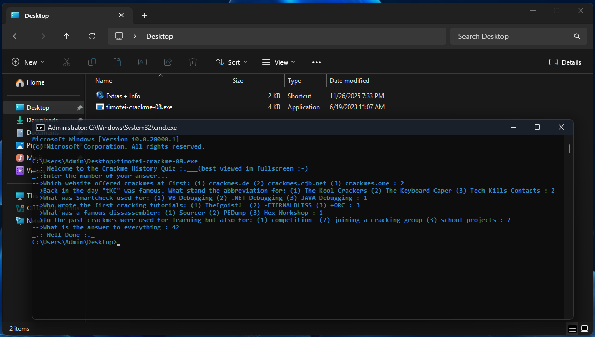

# timotei-crackme-08

Crackme **PE32 console**, MASM32, **quiz** (Crackme History Quiz).
Auteur : timotei (crackmes.one). 7 questions, pas de keyfile.

Dossier : `timotei-family/timotei-crackme-08/` — [série](../README.md) · [repo](../../README.md).

| Fichier | Rôle |
|---|---|
| `timotei-crackme-08.exe` | binaire d’origine |
| [`timotei-crackme-08.md`](timotei-crackme-08.md) | ce write-up |
| [`timotei-crackme-08-solve.py`](timotei-crackme-08-solve.py) | réponses + prédicat (section 6) |
| [`timotei-crackme-08.c`](timotei-crackme-08.c) | prédicat C (section 8) |
| [`timotei-crackme-08-idapro.asm`](timotei-crackme-08-idapro.asm) | listing IDA (section 8) |
| [`timotei-crackme-08-idapro.c`](timotei-crackme-08-idapro.c) | Hex-Rays 9.4 (section 8) |
| [`screenshot01.png`](screenshot01.png) | live cmd : séquence gagnante + Well Done (section 5) |

## Réponses

| # | Question (résumé) | Réponse | Détail |
|---|---|---|---|
| 1 | Premier site de crackmes | **2** | crackmes.cjb.net |
| 2 | tKC = ? | **2** | The Keyboard Caper |
| 3 | Smartcheck | **1** | VB Debugging |
| 4 | Premiers tutos cracking | **3** | +ORC |
| 5 | Désassembleur célèbre | **1** | Sourcer |
| 6 | Crackmes servaient aussi à | **2** | joining a cracking group |
| 7 | Answer to everything | **42** | Hitchhiker’s Guide |

Séquence : `2 2 1 3 1 2 42` → `_.: Well Done :._`  
Preuve live : [screenshot01.png](screenshot01.png).

---

## 1. Premier regard

```
file timotei-crackme-08.exe
# PE32 console, 3584 octets, 3 sections

diec → MASM 6.14 / masm32 / link 5.12
```

Imports : `GetStdHandle`, `WriteConsoleA`, `ReadConsoleA`, `ExitProcess` (kernel32) + **`atoi`** (msvcrt).

Hashes : MD5 `13b51432e2a0755ea5631d455976a8d4`, SHA256 `11a9accd9afb18245c559dbbbc93a5ceb833e118dfd52a6299bc1b97e6bdc37e`.

---

## 2. Flow global

```
ebx = 0
WriteConsole(welcome)
WriteConsole("Enter the number of your answer...")

pour chacune des 6 QCM :
    WriteConsole(question)
    ReadConsole(buffer, 0x64)
    bl += buffer[0]                 ; 1er caractère seulement ('1'/'2'/'3')

WriteConsole("What is the answer to everything :")
ReadConsole(buffer, 0x64)
eax = atoi(buffer)
ebx -= eax
bl  -= 1
si bl != 0 : ExitProcess(0)         ; silence
WriteConsole("Well Done")
ExitProcess(0)
```

Pas de message d’échec : mauvaise réponse → sortie muette.

---

## 3. Le prédicat (en détail)

Il n’y a **pas** de `strcmp` ni de table de bonnes réponses. Le binaire ne vérifie qu’une **égalité arithmétique** sur des registres. Si elle est fausse → `ExitProcess(0)` sans texte. Si elle est vraie → `WriteConsole("_.: Well Done :._")`.

### 3.1 Ce que le programme accumule

Au début :

```
xor  ebx, ebx          ; ebx = 0  (bl = 0 aussi)
```

Pour **chaque** des 6 QCM :

```
ReadConsoleA(..., Buffer, 0x64, ...)   ; tu tapes p.ex. "2\r\n"
add  bl, Buffer                        ; Buffer = 1er octet seulement
```

Points importants :

| Fait | Conséquence |
|---|---|
| `add **bl**, Buffer` | seul l’octet bas de `ebx` change ; `bh` et le reste restent 0 tant qu’il n’y a pas de retenue… |
| `Buffer` = adresse d’un `char` | on lit **un seul octet** : le premier caractère saisi (`'1'`, `'2'` ou `'3'`) |
| suite de la ligne ignorée | `2abc\r\n` ≡ `2` pour le prédicat |
| wrap 8 bits | `bl` est un registre 8 bits : au-delà de 255 → modulo 256 |

Après les 6 lectures :

```
sum ≔ (ord(a1[0]) + ord(a2[0]) + … + ord(a6[0]))  mod 256
ebx = sum          ; en pratique 0 ≤ sum ≤ 6×0x33 = 306, donc un wrap est possible
```

Avec des réponses « normales » (`'1'`/`'2'`/`'3'`), sum ∈ **[0x31×6 … 0x33×6] = [186 … 306]**.  
306 = 0x132 → en 8 bits **0x32** (50). Donc le wrap **peut** arriver si beaucoup de `'3'`.

### 3.2 Ce que fait la 7ᵉ question

```
ReadConsoleA(..., Buffer, ...)   ; p.ex. "42\r\n"
push  offset Buffer
call  atoi                       ; msvcrt : parse la ligne entière → eax = 42
sub   ebx, eax                   ; ebx := ebx - 42   (soustraction 32 bits)
sub   bl, 1                      ; bl  := bl - 1     (octet bas seulement)
jnz   loc_exit                   ; si bl ≠ 0 → échec silencieux
; sinon Well Done
```

Écrit en une formule (équivalent du test final) :

```
((sum - n) & 0xFF) - 1 ≡ 0  (mod 256)
```

soit encore :

```
(sum - n) ≡ 1  (mod 256)
```

avec `n = atoi(Q7)`.

**Lecture intuitive** : après les 6 QCM, le « score » dans `bl` doit valoir **`n + 1`**.  
Avec `n = 42` (réponse attendue culturellement), il faut **`sum ≡ 43 (mod 256)`**.

Hex-Rays écrit la même idée sous une forme plus courte (voir §8) :

```c
if ( v5 - (unsigned __int8)atoi(&Buffer) == 1 )
```

Pour `n` entre 0 et 255, c’est la même condition. Le C à la main / le solveur Python suivent plutôt l’asm (`sub ebx, eax` puis test sur `bl`).

### 3.3 Pourquoi les ASCII `'1'`, `'2'`, `'3'`

Ce ne sont **pas** les valeurs numériques 1, 2, 3 qui sont additionnées, mais leurs **codes ASCII** :

| Caractère | Code | Hex |
|---|---|---|
| `'1'` | 49 | `0x31` |
| `'2'` | 50 | `0x32` |
| `'3'` | 51 | `0x33` |

On peut factoriser :

```
sum = n1·49 + n2·50 + n3·51
    = (n1+n2+n3)·49 + n2·1 + n3·2
```

avec `n1 + n2 + n3 = 6` (une réponse par QCM) :

```
sum = 6×49 + n2 + 2·n3
    = 294 + n2 + 2·n3
```

**Attention au wrap** : 294 = `0x126` → en 8 bits **`0x26` = 38**.  
Donc modulo 256 :

```
sum ≡ 38 + n2 + 2·n3   (mod 256)
```

(On retrouve la forme « 38 + … » souvent écrite directement, déjà réduite modulo 256.)

On veut `sum ≡ 43 (mod 256)` pour Q7 = 42 :

```
38 + n2 + 2·n3 ≡ 43  (mod 256)
     n2 + 2·n3 ≡ 5
```

avec `n1, n2, n3 ≥ 0`, `n1+n2+n3 = 6`, et chaque réponse ∈ {1,2,3}.

### 3.4 Solutions entières de `n2 + 2·n3 = 5`

| n3 | n2 = 5 − 2·n3 | n1 = 6 − n2 − n3 | Valide ? |
|---|---|---|---|
| 0 | 5 | 1 | oui (cinq « 2 », un « 1 ») |
| 1 | 3 | 2 | oui ← **séquence historique** |
| 2 | 1 | 3 | oui |
| 3 | −1 | — | impossible |

Donc **trois familles** de sextuplets passent avec Q7=42, pas une seule grille.  
Exemples :

| Sextuplet (ordre libre tant que les comptes tiennent) | n2 | n3 | sum & 0xFF |
|---|---|---|---|
| `2 2 1 3 1 2` (historique) | 3 | 1 | 43 |
| `2 2 2 2 2 1` | 5 | 0 | 43 |
| `1 1 1 2 3 3` | 1 | 2 | 43 |

Le crackme accepte **toutes** ces familles. Les réponses du write-up sont le croisement **culture cracking + contrainte math**, pas l’unique clé.

### 3.5 Trace complète de la séquence gagnante

Séquence : **`2 2 1 3 1 2`** puis **`42`**.

| Étape | Saisie | Octet lu | Opération | `bl` (hex) | `bl` (déc) |
|---|---|---|---|---|---|
| init | — | — | `xor ebx, ebx` | `00` | 0 |
| Q1 | `2` | `0x32` (50) | `add bl` | `32` | 50 |
| Q2 | `2` | `0x32` | `add bl` | `64` | 100 |
| Q3 | `1` | `0x31` (49) | `add bl` | `95` | 149 |
| Q4 | `3` | `0x33` (51) | `add bl` | `C8` | 200 |
| Q5 | `1` | `0x31` | `add bl` | `F9` | 249 |
| Q6 | `2` | `0x32` | `add bl` | `2B` | **43** ← wrap : 249+50=299=256+43 |
| Q7 | `42` | — | `atoi` → eax=42 | | |
| | | | `sub ebx, eax` | `01` | 1  (43−42) |
| | | | `sub bl, 1` | `00` | 0 |
| | | | `jnz` non pris | | → **Well Done** |

Le wrap à Q6 est normal : 249+50 dépasse 255, `bl` redevient 43. C’est exactement la valeur voulue.

### 3.6 Contre-exemples (pourquoi ça rate)

**Q1 = 1**, reste identique, Q7 = 42 :

```
sum ASCII 8 bits = 42
42 - 42 = 0
0 - 1 = 0xFF ≠ 0  → jnz → silence
```

Un seul caractère décalé d’une unité sur un QCM → sum décalé d’1 → échec (sauf si un autre QCM compense).

**MC corrects, Q7 = 41** :

```
43 - 41 = 2
2 - 1 = 1 ≠ 0  → fail
```

**MC corrects, Q7 = 43** :

```
43 - 43 = 0
0 - 1 = 0xFF ≠ 0  → fail
```

Seul **`n` tel que `(43 - n) ≡ 1 (mod 256)`** marche avec ce sum, i.e. **`n ≡ 42 (mod 256)`**.  
En pratique on tape `42` (Adams / Hitchhiker’s Guide). `298` (= 42+256) passerait l’asm 8 bits final mais plus le cast Hex-Rays (voir §8).

### 3.7 Résumé en une ligne

```
succès  ⇔  ( Σᵢ₌₁⁶ ord(Qi[0])  −  atoi(Q7) )  ≡  1   (mod 256)
```

Avec les choix culturels du quiz + Q7=42, la somme des 6 premiers caractères doit valoir **43** (mod 256), ce que réalise entre autres **`2 2 1 3 1 2`**.

Preuve live : [screenshot01.png](screenshot01.png).  
Vérif hors Windows : `python3 timotei-crackme-08-solve.py` / `timotei-crackme-08.c`.

---

## 4. Contenu culturel (pourquoi ces choix)

1. **crackmes.cjb.net** — hébergement cjb.net « first » avant l’ère crackmes.de / crackmes.one.  
2. **tKC = The Keyboard Caper** — option (2).  
3. **SmartCheck** (NuMega) = debug **VB**.  
4. **+ORC** — premiers tutos « how to crack » (cohérent avec #04 / #01).  
5. **Sourcer** — désassembleur DOS célèbre.  
6. **joining a cracking group** — crackme comme test d’entrée.  
7. **42** — Adams.

Le prédicat n’exige **pas** que les QCM soient « justes » historiquement : n’importe quel sextuplet avec `n2+2×n3=5` + Q7=42 passe. Les réponses ci-dessus sont le point de croisement **histoire + math**.

---

## 5. Vérification

### Live Windows (screenshot01)



Sur [screenshot01.png](screenshot01.png) (`cmd`, Desktop) :

```
-->… crackmes at first: … : 2
-->… tKC … : 2
-->… Smartcheck … : 1
-->… first cracking tutorials: … : 3
-->… famous dissassembler: … : 1
-->… joining a cracking group … : 2
-->What is the answer to everything : 42
_.: Well Done :._
```

La séquence collée dans le write-up est donc **validée en live**, pas seulement par le prédicat Python/C.

### Prédicat hors Windows

```bash
python3 timotei-crackme-08-solve.py
gcc -O0 -o /tmp/cm08 timotei-crackme-08.c && /tmp/cm08
# _.: Well Done :._
/tmp/cm08 1 2 1 3 1 2 42
# (fail)
```

Wine (console réelle) :

```
wineconsole timotei-crackme-08.exe
```

Une ligne par question : `2` `2` `1` `3` `1` `2` `42`.

---

## 6. Solveur Python

[`timotei-crackme-08-solve.py`](timotei-crackme-08-solve.py) — affiche les réponses, vérifie `quiz_ok`, rappelle la saisie Wine.

---

## 7. Récap des adresses

| VA | Quoi |
|---|---|
| `0x401000` | start, GetStdHandle |
| `0x401062` … `0x401180` | `add bl, [buffer]` après chaque QCM |
| `0x4011B8` | `push buffer` / `atoi` (Q7) |
| `0x4011C3` | `sub ebx, eax` / `sub bl, 1` / `jne` |
| `0x4011CA` | WriteConsole « Well Done » |
| `0x403000` | welcome |
| `0x403075` | « Enter the number… » |
| `0x4030D9`…`0x4032E7` | les 7 questions |
| `0x40330D` | Well Done |
| `0x403321` | buffer réponses |
| `0x4033ED` / `0x4033F1` | handles stdin / stdout |

---

## 8. Dumps IDA Pro (asm + Hex-Rays)

| Fichier | Origine |
|---|---|
| [`timotei-crackme-08-idapro.asm`](timotei-crackme-08-idapro.asm) | listing IDA |
| [`timotei-crackme-08-idapro.c`](timotei-crackme-08-idapro.c) | Hex-Rays 9.4 |
| [`timotei-crackme-08.c`](timotei-crackme-08.c) | C à la main, juste le prédicat |

Hashes IDA = binaire : MD5 `13B51432E2A0755EA5631D455976A8D4`, SHA256 `11A9ACCD…BDC37E`.

### Ça correspond

Le listing reprend le graphe de la section 2 : `xor ebx, ebx`, six `add bl, Buffer` après chaque `ReadConsole`, puis Q7 :

```
push    offset Buffer
call    atoi
sub     ebx, eax
sub     bl, 1
jnz     short loc_exit
; WriteConsole "Well Done"
```

Hex-Rays fusionne `sub ebx` + `sub bl, 1` + le test en une seule comparaison 8 bits :

```c
v5 = Buffer + v4;   /* 6× add char, variables char/bl */
/* …
   ReadConsole Q7 … */
if ( v5 - (unsigned __int8)atoi(&Buffer) == 1 )
    WriteConsoleA(..., aWellDone, 0x14u, ...);
ExitProcess(0);
```

| Hex-Rays | Listing / réalité |
|---|---|
| `v0`…`v5` en `char` (bl) | `add bl, Buffer` (seul le 1er octet du buffer) |
| `v5 - (unsigned __int8)atoi(...) == 1` | `sub ebx, eax` ; `sub bl, 1` ; `jnz` |
| chaînes collées (`aWelcome…` + offset `+117`) | deux `WriteConsole` (welcome puis « Enter the number… ») |
| une seule `start` | EP `0x401000` |

Pour la séquence gagnante (`sum=43`, Q7=`42`) : `43 - 42 == 1` → **Well Done**, aligné avec le screenshot et le solveur.

### Pièges

1. **« Compiler : Visual C++ »** — faux. DIE : MASM32 6.14 / link 5.12. Même artefact qu’aux #05–#07.

2. **`atoi` tronqué en `unsigned __int8`**. Hex-Rays cast le résultat avant la soustraction. L’asm fait `sub ebx, eax` sur **tout** le `int` renvoyé par `atoi`, puis ne regarde que `bl` après `sub bl, 1`.  
   - Q7 = `42` : les deux modèles coïncident (`43-42-1 → bl=0`).  
   - Q7 hors 0…255 (ex. `298`) : l’asm et Hex-Rays peuvent diverger ; le C à la main suit l’asm (`(sum - n - 1) & 0xFF == 0` avec `n = atoi` complet).

3. **Chaînes découpées**. IDA a collé welcome + « Enter the number… » + Q1 dans un gros `char[]` ; le code écrit encore deux blocs (`0x75` puis `0x64` octets) avant le premier `ReadConsole`.

4. **Échec silencieux**. Si le `if` est faux, Hex-Rays tombe directement sur `ExitProcess(0)` — pas de message « wrong ».

### C à la main

```c
ebx = 0;
for (i = 0; i < 6; i++)
    ebx = (ebx + ans[i][0]) & 0xFF;
ebx = (ebx - atoi(ans[6])) & 0xFF;
return (ebx - 1) == 0;
```

---

## 9. Notes

- MASM32 (DIE), pas Visual C++ malgré l’en-tête IDA.  
- Seul le **premier** caractère des QCM compte (`2abc` ≡ `2`).  
- Q7 passe par **`atoi`** : `42`, `42\r\n`, espaces OK.  
- Dumps IDA : [`timotei-crackme-08-idapro.asm`](timotei-crackme-08-idapro.asm) + [`timotei-crackme-08-idapro.c`](timotei-crackme-08-idapro.c).
