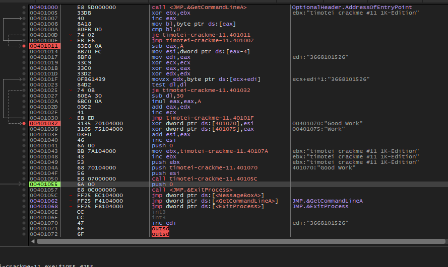

# timotei-crackme-11

Crackme **PE32 GUI**, **1 Ko** (« 1K-Edition »), Polink-style.
Auteur : timotei (crackmes.one). Pas de dialog : **command line + MessageBox**.

Dossier : `timotei-family/timotei-crackme-11/` — [série](../README.md) · [repo](../../README.md).

| Fichier | Rôle |
|---|---|
| `timotei-crackme-11.exe` | binaire d’origine (1024 o) |
| [`timotei-crackme-11.md`](timotei-crackme-11.md) | ce write-up |
| [`timotei-crackme-11-solve.py`](timotei-crackme-11-solve.py) | keygen / decrypt (section 6) |
| [`timotei-crackme-11-idapro.asm`](timotei-crackme-11-idapro.asm) | listing IDA |
| [`timotei-crackme-11-idapro.c`](timotei-crackme-11-idapro.c) | Hex-Rays 9.4 |
| [`timotei-crackme-11-recon.c`](timotei-crackme-11-recon.c) | recon C (section 9) |
| [`timotei-crackme-11-recon.exe`](timotei-crackme-11-recon.exe) | PE recon MinGW (hWnd=NULL, affiche) |
| [`timotei-crackme-11-recon-fasm.asm`](timotei-crackme-11-recon-fasm.asm) | recon FASM (section 9) |
| [`timotei-crackme-11-recon-fasm.bin`](timotei-crackme-11-recon-fasm.bin) | PE recon FASM (hWnd=NULL, affiche) |
| [`screenshot01.png`](screenshot01.png) | x64dbg : XOR → `Good Work` (section 5) |

## Réponse

| Input | Valeur |
|---|---|
| argument (14 car. en fin de command line) | **`t62O3668101526`** |
| MessageBox texte | **`Good Work`** |
| MessageBox titre | `timotei crackme #11 1K-Edition` |

```bash
# Windows / VM
timotei-crackme-11.exe t62O3668101526
```

Preuve : [screenshot01.png](screenshot01.png) (x64dbg, mémoire `0x401070` = `Good Work` après decrypt).

---

## 1. Premier regard

```
file timotei-crackme-11.exe
# PE32 GUI, 1024 octets, 1 section .text

Linker 2.50 (Polink) — « 1K-Edition »
```

Imports uniquement : `GetCommandLineA`, `MessageBoxA`, `ExitProcess`.

Hashes : MD5 `a03c3b5ca3ccfd7ced15b3e1eeeb2f94`, SHA256 `fc78eb900757f454e9e2065db2af3c5d8eef306999bf45ea534094c7971efa1c`.

---

## 2. Flow

```
start @ 401000
    GetCommandLineA
    ; avancer jusqu'au NUL (inc eax / cmp [eax],0)
    eax = fin - 10                 ; 10 derniers caractères
    esi = dword [eax-4]            ; 4 octets juste avant
    edi = eax
    n = 0
    pour chaque octet jusqu'au NUL :
        n = n*10 + (byte - '0')    ; pas de test isdigit
    xor dword [0x401070], esi      ; 4 premiers octets du message
    xor dword [0x401075], n        ; octets 5..8 (le [4] = 0x20 reste)
    hWnd = esi + n + 1
    MessageBoxA(hWnd, 0x401070, 0x40107B, 0)
    ExitProcess(0)
```

Titre en clair @ `0x40107B` : **`timotei crackme #11 1K-Edition`**.

Message chiffré @ `0x401070` (10 octets) :

```text
33 59 5d 2b 20 c1 a6 d0 b1 00
\-- ^= esi --/ sp \-- ^= n --/ NUL
```

Pas de branche « wrong password » : le MessageBox part toujours ; le win = un **texte lisible**.

---

## 3. Format de l’argument

Les **14 derniers caractères** de la command line (hors `\0`) :

```text
 K K K K  D D D D D D D D D D
 \--esi--/ \------- n ------/
```

| Partie | Exemple | Rôle |
|---|---|---|
| clé 4 octets | `t62O` | `esi` (LE dword) |
| 10 chiffres | `3668101526` | `n` |

```text
argv = t62O3668101526
msg  = "Good Work"
```

Autres couples clé/n donnent d’autres phrases (`Well Done`, etc.) ; **`Good Work`** est le couple retenu.

---

## 4. Formule

```text
esi = uint32_LE(arg[0:4])
n   = int(arg[4:14])
msg[0:4] ^= pack_LE(esi)
msg[5:9] ^= pack_LE(n)      # msg[4] reste ' '
MessageBox(text=msg, caption=title)
```

Inverse (keygen pour un message avec espace en position 4) :

```text
esi = cipher[0:4] XOR clear[0:4]
n   = cipher[5:9] XOR clear[5:9]
arg = pack_LE(esi) + f"{n:010d}"
```

---

## 5. Vérification

### Windows (screenshot01)



Sur [screenshot01.png](screenshot01.png) :

- `edi` / parse → `3668101526`
- après `xor [401070], esi` / `xor [401075], eax` : **`Good Work`**
- titre : `timotei crackme #11 1K-Edition`
- IP vers `MessageBoxA`

### Wine (piège)

Sous Wine, le même appel est bien fait :

```text
MessageBoxA(0x29d5000b, "Good Work", "timotei crackme #11 1K-Edition", 0)
→ retval = 0xFFFFFFFF   # échec
```

`hWnd = esi+n+1` n’est **pas** une fenêtre valide. Windows affiche souvent quand même ; **Wine refuse** → retour immédiat, **aucune boîte**.

| Commande Wine | Résultat visible |
|---|---|
| `wine …exe` / `… test` | rien (texte poubelle + hWnd pourri) |
| `wine …exe t62O3668101526` | rien non plus (texte OK, hWnd pourri) |
| VM Windows + même arg | **Good Work** |

Contournement analyse sous Linux : `WINEDEBUG=+relay` pour lire le texte dans le log, ou patch local `hWnd=0` (`add esi,eax`/`inc esi` → `xor esi,esi` @ `0x40103E`).

### Solveur

```bash
python3 timotei-crackme-11-solve.py
python3 timotei-crackme-11-solve.py --arg
# t62O3668101526
```

---

## 6. Solveur Python

[`timotei-crackme-11-solve.py`](timotei-crackme-11-solve.py) — affiche l’argv gagnant, `--decode`, `--for-msg`.

---

## 7. Adresses

| VA | Quoi |
|---|---|
| `0x401000` | `start` / `GetCommandLineA` |
| `0x401011` | `sub eax, 0Ah` |
| `0x401014` | `mov esi, [eax-4]` |
| `0x40101F` | boucle parse décimal |
| `0x401032` | `xor [401070], esi` |
| `0x401038` | `xor [401075], eax` (`n`) |
| `0x40104F` | `push esi` = hWnd |
| `0x401055` | `call MessageBoxA` |
| `0x401070` | message chiffré / déchiffré |
| `0x40107B` | titre en clair |

---

## 8. Dumps IDA (asm + Hex-Rays)

| Fichier | Origine |
|---|---|
| [`timotei-crackme-11-idapro.asm`](timotei-crackme-11-idapro.asm) | listing IDA |
| [`timotei-crackme-11-idapro.c`](timotei-crackme-11-idapro.c) | Hex-Rays 9.4 |

Hex-Rays (extrait) :

```c
CommandLineA = GetCommandLineA();
do ++CommandLineA; while (*CommandLineA != 0);
v1 = CommandLineA - 10;
v2 = *((_DWORD *)v1 - 1);   /* esi = clé */
/* parse n sur 10 car. */
*(_DWORD *)Text ^= v2;
dword_401075 ^= v5;
MessageBoxA((HWND)(v5 + v2 + 1), Text, (LPCSTR)&word_40107A + 1, 0);
ExitProcess(0);
```

« Compiler: Visual C++ » → faux (tiny PE / Polink 2.50).

---

## 9. Reconstruction (C + FASM) — pourquoi l’original n’affiche pas

Le decrypt est correct (`Good Work` en mémoire, screenshot01).  
**Le MessageBox échoue** car :

```c
MessageBoxA((HWND)(esi + n + 1), Text, title, 0);
```

`esi+n+1` n’est **pas** un handle de fenêtre. Wine renvoie `-1` ; beaucoup de Windows récents aussi → **aucune boîte**.

| Fichier | hWnd | Affiche ? |
|---|---|---|
| `timotei-crackme-11.exe` (origine) | `esi+n+1` | souvent **non** |
| [`timotei-crackme-11-recon.exe`](timotei-crackme-11-recon.exe) (MinGW) | **`NULL`** | **oui** |
| [`timotei-crackme-11-recon-fasm.bin`](timotei-crackme-11-recon-fasm.bin) | **`NULL`** | **oui** |
| C avec `-DUSE_ORIGINAL_HWND` | `esi+n+1` | comme l’origine |

### Lancer le recon (binaire fourni)

```bash
# MinGW (recon.exe)
wine timotei-crackme-11-recon.exe t62O3668101526
# ou sous Windows :
timotei-crackme-11-recon.exe t62O3668101526

# FASM (équivalent plus compact)
wine timotei-crackme-11-recon-fasm.bin t62O3668101526
# → MessageBox "Good Work"
```

### Recompiler le C (MinGW 32-bit)

```bash
# Linux
sudo apt install mingw-w64
i686-w64-mingw32-gcc -mwindows -O0 \
  -o timotei-crackme-11-recon.exe timotei-crackme-11-recon.c

# strict original (hWnd pourri) :
i686-w64-mingw32-gcc -mwindows -O0 -DUSE_ORIGINAL_HWND \
  -o timotei-crackme-11-recon-orighwnd.exe timotei-crackme-11-recon.c
```

Sous Windows : [MinGW-w64](https://www.mingw-w64.org/) / MSYS2, puis `gcc -mwindows …`.

### Recompiler le FASM

```bash
fasm timotei-crackme-11-recon-fasm.asm timotei-crackme-11-recon-fasm.bin
```

---

## 10. Notes

- Toute la logique tient dans **~0x60 octets** + message + imports (une section).
- Parse sans test `isdigit` ; solution propre = 10 chiffres.
- Argument en **fin** de command line (rien après).
- Le « bug » d’affichage fait partie de l’original ; le recon corrige uniquement le `hWnd` pour pouvoir valider le prédicat en live.
