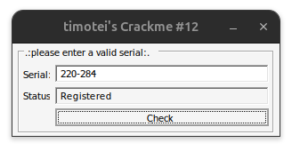

# timotei-crackme-12

Crackme **PE32 GUI**, MASM32, **serial n1-n2** (nombres amiables / parfaits).
Auteur : timotei (crackmes.one). Dernier de la série.

Dossier : `timotei-family/timotei-crackme-12/` — [série](../README.md) · [repo](../../README.md).

| Fichier | Rôle |
|---|---|
| `timotei-crackme-12.exe` | binaire d’origine |
| [`timotei-crackme-12.md`](timotei-crackme-12.md) | ce write-up |
| [`timotei-crackme-12-solve.py`](timotei-crackme-12-solve.py) | prédicat + exemples (section 6) |
| [`timotei-crackme-12-idapro.asm`](timotei-crackme-12-idapro.asm) | listing IDA (section 8) |
| [`timotei-crackme-12-masm.asm`](timotei-crackme-12-masm.asm) | reconstruction MASM32 (section 9) |
| [`timotei-crackme-12-masm.rc`](timotei-crackme-12-masm.rc) | dialog ressource MASM |
| [`screenshot01.png`](screenshot01.png) | live : `220-284` → Registered (section 5) |

## Réponse (famille)

| Input | Valeur | Rôle |
|---|---|---|
| champ **Serial** | `n1-n2` | ex. **`220-284`**, `284-220`, `6-6` |
| action | **&Check** | `sub_40112F` |
| Status | **Registered** | succès |

```bash
python3 timotei-crackme-12-solve.py
# recommandé : 220-284
```

Preuve live : [screenshot01.png](screenshot01.png).

---

## 1. Premier regard

```
file timotei-crackme-12.exe
# PE32 GUI, 4096 octets, 4 sections

diec → MASM 6.14 / masm32 / link 5.12
```

Imports : dialog user32 + `lstrlenA` + **`atoi`** (msvcrt) + `InitCommonControls`.

UI : prompt `.:please enter a valid serial:.`, défaut Serial **`1234-5678`**, Status, bouton **&Check**, titre `timotei's Crackme #12`.

Hashes : MD5 `8e9b5e1515e5da18c193931c6c6896ca`, SHA256 `5d4254d66ccd1dac09e6e5773551e7cb543fbc8cc4da680131c745985c938848`.

---

## 2. Flow global

```
start @ 401000
    InitCommonControls / icône / curseur
    DialogBoxParam(dialog 0x64, DialogFunc @ 40104F)

DialogFunc:
    WM_INITDIALOG (0x110)
        subclass WndProc (curseur)
        EM_LIMITTEXT 0x31 sur Serial (405)
        prompt (400) ← ".:please enter a valid serial:."
        Serial (405) ← "1234-5678"
        call sub_40112F                 ; check immédiat

    WM_COMMAND (0x111), id 0x192        ; &Check
        call sub_40112F

    WM_CLOSE (0x10)
        EndDialog
```

| ID | Déc | Rôle |
|---|---|---|
| `0x190` | 400 | prompt |
| `0x195` | **405** | **Serial** |
| `0x196` | **406** | **Status** |
| `0x192` | **402** | bouton Check |

Pas de `WM_MOUSEMOVE` killer (contrairement au #10).

---

## 3. Le prédicat (`sub_40112F` + `sub_4011D5`)

### 3.1 Lecture et `atoi`

```asm
GetDlgItemTextA(hDlg, 195h, buffer@403050, 32h)
lstrlen → 0 ? fail
n1 = atoi(buffer)          ; msvcrt : s'arrête au premier non-digit
                           ; "220-284" → n1 = 220
call sub_4011D5            ; s(n1) → [4030AE]
```

### 3.2 Somme des diviseurs propres (`sub_4011D5`)

```asm
; in : eax = n
s_sum = 0
ebx = 1
ecx = n - 1
loop:
    if (n % ebx == 0) s_sum += ebx
    ebx++
    loop
```

```text
s(n) = Σ { d | 1 ≤ d < n, n % d == 0 }
```

(équivalent à σ(n) − n, somme des diviseurs propres.)

### 3.3 Deuxième nombre et double check

```asm
; scan buffer pour le premier '-'
; si absent → fail
n2 = atoi(après '-')
cmp s(n1), n2              ; doit être égal
call sub_4011D5            ; s(n2)
cmp n1, s(n2)              ; doit être égal
→ Registered / Unregistered
```

### 3.4 Formule

```text
succès  ⇔  s(n1) == n2  ∧  s(n2) == n1
```

avec `n1 = atoi(serial)`, `n2 = atoi(après '-')`.

Interprétation mathématique :

| Cas | Nom |
|---|---|
| `n1 ≠ n2` et conditions | **paire amiable** |
| `n1 == n2` | **nombre parfait** |

### 3.5 Exemples

| Serial | Type | s(n1) / s(n2) |
|---|---|---|
| **`220-284`** | amiable | 284 / 220 |
| `284-220` | amiable | 220 / 284 |
| `6-6`, `28-28`, `496-496` | parfait | n / n |
| `1184-1210` | amiable | … |
| `1234-5678` (défaut UI) | **fail** | s(1234)=620 ≠ 5678 |

---

## 4. Contenu culturel

Les paires amiables (220, 284) et les nombres parfaits sont un classique des crackmes « maths ». Le format `n1-n2` et le défaut factice `1234-5678` poussent à reverse le check plutôt qu’à brute-forcer l’UI.

---

## 5. Vérification

### Live (screenshot01)



Sur [screenshot01.png](screenshot01.png) :

```
.:please enter a valid serial:.
Serial: 220-284
Status: Registered
```

### Solveur

```bash
python3 timotei-crackme-12-solve.py
python3 timotei-crackme-12-solve.py --check 220-284
python3 timotei-crackme-12-solve.py --check 1234-5678
```

### Original

```bash
wine timotei-crackme-12.exe
# Serial: 220-284 → Check → Registered
```

---

## 6. Solveur Python

[`timotei-crackme-12-solve.py`](timotei-crackme-12-solve.py) — rejoue `s(n)`, liste des paires connues, `--check`.

---

## 7. Récap des adresses

| VA | Quoi |
|---|---|
| `0x401000` | `start` |
| `0x40104F` | `DialogFunc` |
| `0x4010F8` | subclass WndProc (curseur) |
| `0x40112F` | **`sub_40112F`** — check serial |
| `0x4011D5` | **`sub_4011D5`** — s(n) |
| `0x403000` | prompt |
| `0x403020` | `1234-5678` |
| `0x40302A` / `0x403037` | Unregistered / Registered |
| `0x403050` | buffer serial |
| `0x4030AE` | s(n) |
| `0x4030B6` | n1 (atoi) |

---

## 8. Dump IDA Pro

| Fichier | Origine |
|---|---|
| [`timotei-crackme-12-idapro.asm`](timotei-crackme-12-idapro.asm) | listing IDA |

Hashes IDA = binaire. « Compiler: Visual C++ » → faux (MASM32).

Le listing montre clairement `atoi`, la boucle `div ebx` / `add dword_4030AE, ebx`, le scan `'-'`, et les deux comparaisons avant Registered.

---

## 9. Reconstruction MASM32

| Fichier | Rôle |
|---|---|
| [`timotei-crackme-12-masm.asm`](timotei-crackme-12-masm.asm) | source (DialogFunc, CheckSerial, AliquotSum, MyAtoi) |
| [`timotei-crackme-12-masm.rc`](timotei-crackme-12-masm.rc) | dialog Serial / Status / Check |

Même prédicat et mêmes IDs (400 / 405 / 406 / 402). `MyAtoi` remplace `msvcrt!atoi` pour éviter une dépendance de link inutile.

### Compiler (Windows + MASM32)

```bat
cd timotei-crackme-12
\masm32\bin\rc /v timotei-crackme-12-masm.rc
\masm32\bin\ml /c /coff /Cp timotei-crackme-12-masm.asm
\masm32\bin\link /SUBSYSTEM:WINDOWS /RELEASE ^
    /OUT:timotei-crackme-12-masm.exe ^
    timotei-crackme-12-masm.obj timotei-crackme-12-masm.res
```

Puis Serial **`220-284`** → Check → Registered.

---

## 10. Notes

- Dernier crackme de la série timotei (12/12).
- Boucle s(n) en O(n) : les grands n rendent le check lent (220/284 restent instantanés).
- `atoi` s’arrête au `'-'` : le format doit être **chiffres, tiret, chiffres**.
- Famille large : toute paire amiable / parfait au format `n1-n2` passe.
